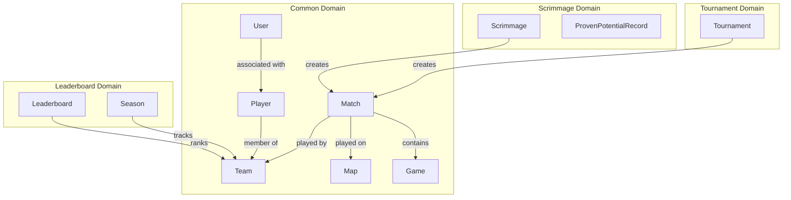
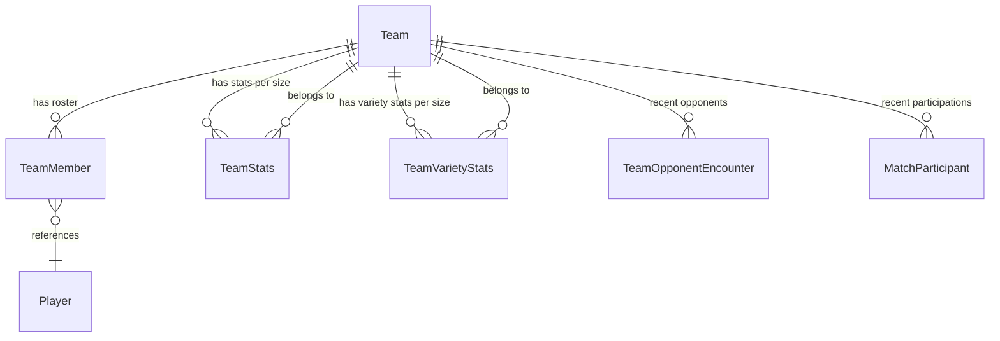
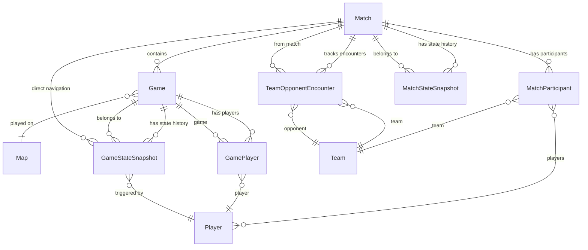
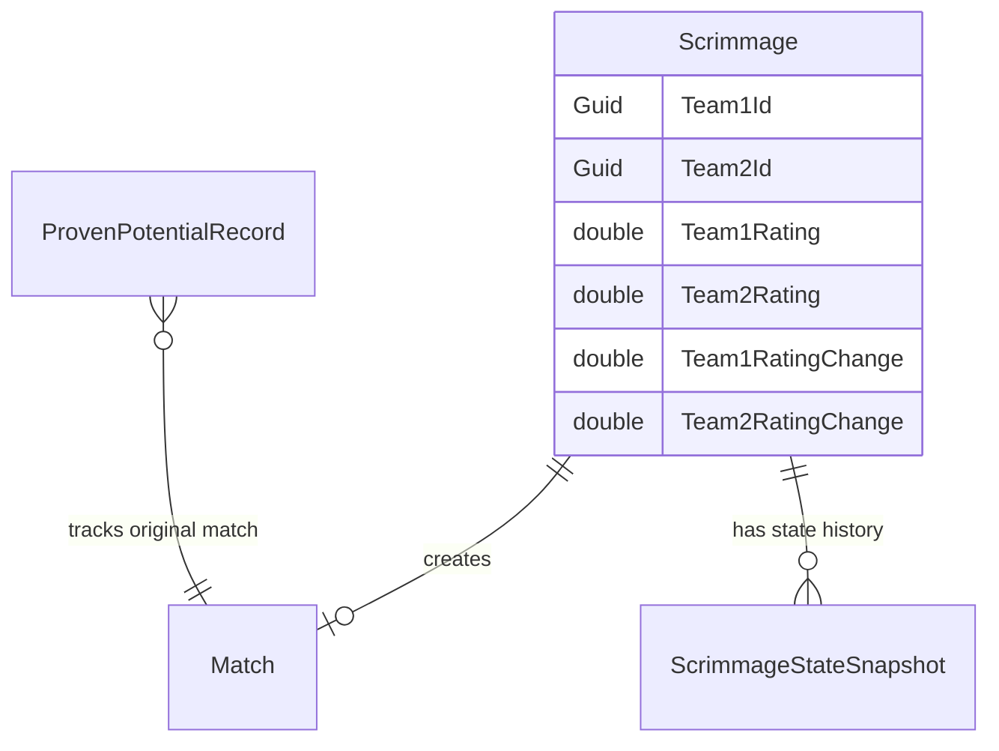
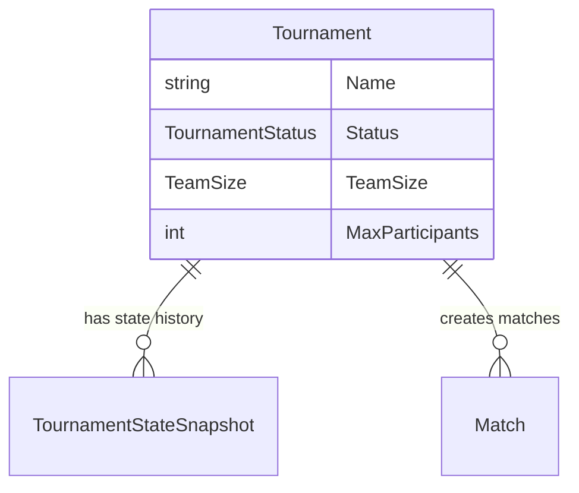
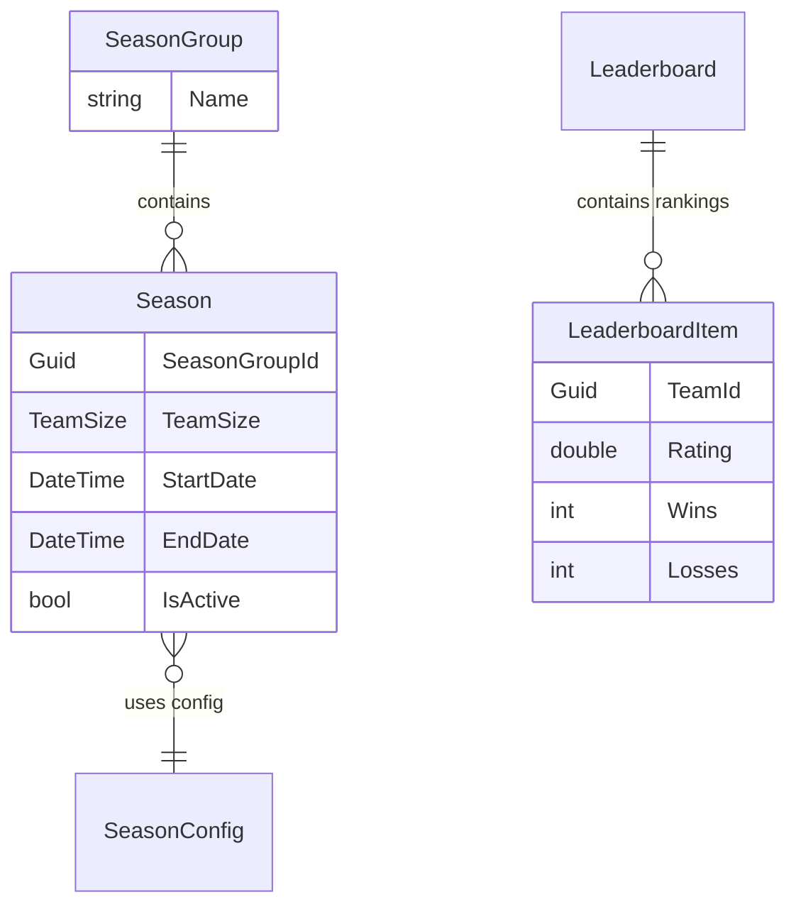
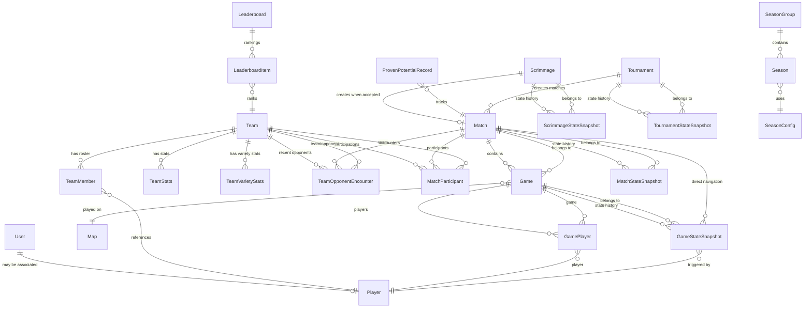

# WabbitBot Entity Relationship Map

**Last Updated:** 2025-10-01 (Updated after Match/Game optimization)  
**Purpose:** Complete documentation of all entity classes and their relationships across domains

---

## Table of Contents
1. [Overview](#overview)
2. [Domain Architecture](#domain-architecture)
3. [Common Domain Entities](#common-domain-entities)
4. [Scrimmage Domain Entities](#scrimmage-domain-entities)
5. [Tournament Domain Entities](#tournament-domain-entities)
6. [Leaderboard Domain Entities](#leaderboard-domain-entities)
7. [Complete Relationship Diagram](#complete-relationship-diagram)
8. [Data Modeling Issues](#data-modeling-issues)

---

## Overview

The WabbitBot system uses a **Vertical Slice Architecture** with entities organized by domain:
- **Common** - Core entities shared across features (Match, Game, Player, Team, User, Map)
- **Scrimmage** - Scrimmage-specific entities and state management
- **Tournament** - Tournament-specific entities and state management
- **Leaderboard** - Ranking and season entities

All entities inherit from `Entity` base class which provides:
- `Guid Id` - Primary key
- `DateTime CreatedAt` - Timestamp of creation
- `DateTime UpdatedAt` - Timestamp of last update
- `Domain Domain` - Domain classification

---

## Domain Architecture



---

## Common Domain Entities

### Core Entities

#### User
**Purpose:** Represents a Discord user  
**Relationships:**
- May be associated with one `Player` (via `PlayerId`)

```csharp
public class User : Entity
{
    public string DiscordId { get; set; }
    public string Username { get; set; }
    public Guid? PlayerId { get; set; }  // FK to Player
}
```

#### Player  
**Purpose:** Represents a game player (independent of Discord)  
**Relationships:**
- Can be in multiple `Teams` (via `TeamIds` list)
- Participates in `Games` (via `GamePlayer` join table)
- Triggers `GameStateSnapshot` records

```csharp
public class Player : Entity
{
    public string Name { get; set; }
    public List<Guid> TeamIds { get; set; }
    // Navigation: GamePlayers (via join table)
}
```

#### Map
**Purpose:** Represents a game map  
**Relationships:**
- Referenced by `Games`

```csharp
public class Map : Entity
{
    public string Name { get; set; }
    public string Size { get; set; }
    public bool IsActive { get; set; }
}
```

### Team Hierarchy



**Team Entities:**

#### Team
**Primary aggregate root for team data**  
**Relationships:**
- Has many `TeamMembers` (roster)
- Has stats per `TeamSize` via `TeamStats` dictionary
- Has variety stats per `TeamSize` via `TeamVarietyStats` dictionary
- Has recent `TeamOpponentEncounters`
- Has recent `MatchParticipants`

```csharp
public class Team : Entity
{
    public string Name { get; set; }
    public Guid TeamCaptainId { get; set; }
    public TeamSize TeamSize { get; set; }
    
    // Navigation properties
    public ICollection<TeamMember> Roster { get; set; }
    public Dictionary<TeamSize, TeamStats> TeamStats { get; set; }
    public Dictionary<TeamSize, TeamVarietyStats> VarietyStats { get; set; }
    public ICollection<TeamOpponentEncounter> RecentOpponents { get; set; }
    public ICollection<MatchParticipant> RecentParticipations { get; set; }
}
```

#### TeamMember
**Join entity connecting Players to Teams**  
**Relationships:**
- Belongs to one `Team` (via `TeamId` - **missing in current schema!**)
- References one `Player` (via `PlayerId`)

```csharp
public class TeamMember : Entity
{
    public Guid PlayerId { get; set; }
    public TeamRole Role { get; set; }  // Captain, Core, Substitute
    // ISSUE: Missing TeamId foreign key!
}
```

#### TeamStats
**Tracks team performance for a specific TeamSize**  
**Relationships:**
- Belongs to one `Team` (via `TeamId`)

```csharp
public class TeamStats : Entity
{
    public Guid TeamId { get; set; }
    public TeamSize TeamSize { get; set; }
    public double CurrentRating { get; set; }
    public int Wins { get; set; }
    public int Losses { get; set; }
    
    // Navigation
    public Team Team { get; set; }
}
```

#### TeamVarietyStats
**Tracks opponent variety for a specific TeamSize**  
**Relationships:**
- Belongs to one `Team` (via `TeamId`)

```csharp
public class TeamVarietyStats : Entity
{
    public Guid TeamId { get; set; }
    public TeamSize TeamSize { get; set; }
    public double VarietyEntropy { get; set; }
    public int UniqueOpponents { get; set; }
    
    // Navigation
    public Team Team { get; set; }
}
```

### Match Hierarchy



#### Match
**Core aggregate representing a competitive match**  
**Relationships:**
- Contains multiple `Games`
- Has multiple `MatchParticipants`
- Creates `TeamOpponentEncounters`
- Has `MatchStateSnapshot` history
- Created by either `Scrimmage` or `Tournament` (polymorphic via `ParentId` + `ParentType`)
- Casual/standalone matches have both `ParentId` and `ParentType` set to `null`

```csharp
public enum MatchParentType
{
    Scrimmage,   // Match belongs to a Scrimmage entity
    Tournament,  // Match belongs to a Tournament entity
    // Note: Casual matches use null (no parent)
}

public class Match : Entity
{
    public TeamSize TeamSize { get; set; }
    public Guid? ParentId { get; set; }           // Scrimmage or Tournament ID, null for casual
    public MatchParentType? ParentType { get; set; }  // Scrimmage or Tournament, null for casual
    public Guid Team1Id { get; set; }
    public Guid Team2Id { get; set; }
    public int BestOf { get; set; }
    
    // Navigation properties
    public ICollection<Game> Games { get; set; }
    public ICollection<MatchParticipant> Participants { get; set; }
    public ICollection<TeamOpponentEncounter> OpponentEncounters { get; set; }
    public ICollection<MatchStateSnapshot> StateHistory { get; set; }
}
```

#### MatchParticipant
**Join entity tracking team participation in a match**  
**Relationships:**
- Belongs to one `Match`
- Belongs to one `Team`
- References multiple `Players` (via `PlayerIds` list + collection)

```csharp
public class MatchParticipant : Entity
{
    public Guid MatchId { get; set; }
    public Guid TeamId { get; set; }
    public int TeamNumber { get; set; }  // 1 or 2
    public bool IsWinner { get; set; }
    public List<Guid> PlayerIds { get; set; }
    
    // Navigation
    public Match Match { get; set; }
    public Team Team { get; set; }
    public ICollection<Player> Players { get; set; }
}
```

#### TeamOpponentEncounter
**Tracks team vs opponent encounters for variety calculations**  
**Relationships:**
- Belongs to one `Match`
- References one `Team` (the team)
- References one `Team` (the opponent)

```csharp
public class TeamOpponentEncounter : Entity
{
    public Guid MatchId { get; set; }
    public Guid TeamId { get; set; }
    public Guid OpponentId { get; set; }
    public bool Won { get; set; }
    
    // Navigation
    public Match Match { get; set; }
    public Team Team { get; set; }
    public Team Opponent { get; set; }
}
```

#### MatchStateSnapshot
**Immutable snapshot of match state at a point in time**  
**Relationships:**
- Belongs to one `Match`
- ✅ **FIXED:** Previously had invalid `Games` and `FinalGames` collections - now removed

```csharp
public class MatchStateSnapshot : Entity
{
    public Guid MatchId { get; set; }
    public DateTime Timestamp { get; set; }
    public string UserId { get; set; }
    public string PlayerName { get; set; }
    
    // State data (lifecycle, status, progression)
    public int CurrentGameNumber { get; set; }
    public string? FinalScore { get; set; }
    
    // Map ban state
    public List<string> AvailableMaps { get; set; }
    public List<string> Team1MapBans { get; set; }
    public List<string> Team2MapBans { get; set; }
    public List<string> FinalMapPool { get; set; }
    
    // Navigation - only to parent Match
    public Match Match { get; set; }
}
```

#### Game
**Individual game within a match**  
**Relationships:**
- Belongs to one `Match`
- Played on one `Map`
- Has multiple `GamePlayers` (join table)
- Has `GameStateSnapshot` history

```csharp
public class Game : Entity
{
    public Guid MatchId { get; set; }
    public Guid MapId { get; set; }
    public int GameNumber { get; set; }
    public TeamSize TeamSize { get; set; }
    
    // Navigation
    public Match Match { get; set; }
    public Map Map { get; set; }
    public ICollection<GamePlayer> GamePlayers { get; set; }
    public ICollection<GameStateSnapshot> StateHistory { get; set; }
}
```

#### GamePlayer
**Join entity for many-to-many Game-Player relationship**  
**Relationships:**
- Belongs to one `Game`
- Belongs to one `Player`

```csharp
public class GamePlayer : Entity
{
    public Guid GameId { get; set; }
    public Guid PlayerId { get; set; }
    public int TeamNumber { get; set; }  // 1 or 2
    
    // Navigation
    public Game Game { get; set; }
    public Player Player { get; set; }
}
```

#### GameStateSnapshot
**Immutable snapshot of game state**  
**Relationships:**
- Belongs to one `Game`
- Belongs to one `Match` (direct navigation added for efficient state processing)
- Triggered by one `Player`

```csharp
public class GameStateSnapshot : Entity
{
    public Guid GameId { get; set; }
    public Guid MatchId { get; set; }  // Denormalized for historical completeness
    public Guid PlayerId { get; set; }
    public DateTime Timestamp { get; set; }
    
    // State data (lifecycle, decks, status)
    public DateTime? StartedAt { get; set; }
    public DateTime? CompletedAt { get; set; }
    public Guid? WinnerId { get; set; }
    
    // Deck submission (per-game, not per-match)
    public string? Team1DeckCode { get; set; }
    public string? Team2DeckCode { get; set; }
    
    // Forfeit mirroring (mirrors match forfeit when this game was active)
    public Guid? ForfeitedByUserId { get; set; }
    public Guid? ForfeitedTeamId { get; set; }
    
    // Navigation - to both Game and Match for bidirectional state processing
    public Game Game { get; set; }
    public Match Match { get; set; }  // ✅ Added for direct match access
    public Player Player { get; set; }
}
```

---

## Scrimmage Domain Entities



#### Scrimmage
**Challenge match between two teams**  
**Relationships:**
- May create one `Match` (when accepted)
- Has `ScrimmageStateSnapshot` history

```csharp
public class Scrimmage : Entity
{
    public Guid Team1Id { get; set; }
    public Guid Team2Id { get; set; }
    public TeamSize TeamSize { get; set; }
    public double Team1Rating { get; set; }
    public double Team2RatingChange { get; set; }
    public bool IsAccepted { get; set; }
    
    // Navigation
    public Match? Match { get; set; }  // Created when accepted
    public List<ScrimmageStateSnapshot> StateHistory { get; set; }
}
```

#### ProvenPotentialRecord
**Tracks rating adjustments for new teams**  
**Relationships:**
- References original `Match` (via `OriginalMatchId`)
- References challenger and opponent teams (via GUIDs)

```csharp
public class ProvenPotentialRecord : Entity
{
    public Guid OriginalMatchId { get; set; }
    public Guid ChallengerId { get; set; }
    public Guid OpponentId { get; set; }
    public double RatingAdjustment { get; set; }
    public TeamSize TeamSize { get; set; }
    public bool IsComplete { get; set; }
}
```

#### ScrimmageStateSnapshot
**Immutable snapshot of scrimmage state**  
**Relationships:**
- Belongs to one `Scrimmage`
- **ISSUE:** Has self-referencing `StateHistory` collection!

```csharp
public class ScrimmageStateSnapshot : Entity
{
    public Guid ScrimmageId { get; set; }
    public ScrimmageStatus Status { get; set; }
    
    // Navigation
    public Scrimmage Scrimmage { get; set; }
    
    // ⚠️ DATA MODEL ISSUE:
    public List<ScrimmageStateSnapshot> StateHistory { get; set; }  // Should be removed!
}
```

---

## Tournament Domain Entities



#### Tournament
**Organized competitive event**  
**Relationships:**
- Creates multiple `Matches` (via polymorphic ParentId)
- Has `TournamentStateSnapshot` history

```csharp
public class Tournament : Entity
{
    public string Name { get; set; }
    public TournamentStatus Status { get; set; }
    public TeamSize TeamSize { get; set; }
    public int MaxParticipants { get; set; }
    
    // Navigation
    public ICollection<TournamentStateSnapshot> StateHistory { get; set; }
}
```

#### TournamentStateSnapshot
**Immutable snapshot of tournament state**  
**Relationships:**
- Belongs to one `Tournament`

```csharp
public class TournamentStateSnapshot : Entity
{
    public Guid TournamentId { get; set; }
    public DateTime Timestamp { get; set; }
    public Guid UserId { get; set; }
    
    // Tournament progression
    public List<Guid> RegisteredTeamIds { get; set; }
    public List<Guid> ActiveMatchIds { get; set; }
    public int CurrentRound { get; set; }
    
    // Navigation
    public Tournament Tournament { get; set; }
}
```

---

## Leaderboard Domain Entities



#### SeasonGroup
**Group of coordinated seasons**  
**Relationships:**
- Contains multiple `Seasons` (one per TeamSize)

```csharp
public class SeasonGroup : Entity
{
    public string Name { get; set; }
    // Navigation: Seasons (via SeasonGroupId)
}
```

#### Season
**Season for a specific TeamSize**  
**Relationships:**
- Belongs to one `SeasonGroup`
- Uses one `SeasonConfig`
- Tracks participating teams

```csharp
public class Season : Entity
{
    public Guid SeasonGroupId { get; set; }
    public Guid SeasonConfigId { get; set; }
    public TeamSize TeamSize { get; set; }
    public DateTime StartDate { get; set; }
    public DateTime EndDate { get; set; }
    public Dictionary<string, string> ParticipatingTeams { get; set; }
}
```

#### SeasonConfig
**Configuration for season behavior**  
**Relationships:**
- Used by multiple `Seasons`

```csharp
public class SeasonConfig : Entity
{
    public bool RatingDecayEnabled { get; set; }
    public double DecayRatePerWeek { get; set; }
    public double MinimumRating { get; set; }
}
```

#### Leaderboard
**Rankings aggregator**  
**Relationships:**
- Contains rankings organized by TeamSize

```csharp
public class Leaderboard : Entity
{
    public Dictionary<TeamSize, Dictionary<string, LeaderboardItem>> Rankings { get; set; }
}
```

#### LeaderboardItem
**Individual ranking entry**  
**Relationships:**
- References a `Team` (via `TeamId`)
- May reference multiple `Players` (via `PlayerIds`)

```csharp
public class LeaderboardItem : Entity
{
    public Guid TeamId { get; set; }
    public List<Guid> PlayerIds { get; set; }
    public string Name { get; set; }
    public double Rating { get; set; }
    public int Wins { get; set; }
    public int Losses { get; set; }
}
```

---

## Complete Relationship Diagram



---

## Data Modeling Issues

### ✅ Recently Fixed Issues

#### 1. MatchStateSnapshot Navigation Collections (FIXED ✅)
**Issue:** `MatchStateSnapshot` had `Games` and `FinalGames` navigation properties  
**Problem:** Snapshots are immutable state records - they should NOT have relationships to mutable entities  
**Impact:** Created EF Core shadow foreign keys (`MatchStateSnapshotId1`), confusion about ownership  
**Fix:** ✅ **COMPLETED** - Removed both navigation properties from `MatchStateSnapshot`

```csharp
// ✅ FIXED:
public class MatchStateSnapshot : Entity
{
    // State is captured as scalar values only
    public int CurrentGameNumber { get; set; }
    public string? FinalScore { get; set; }
    public Match Match { get; set; }  // Only navigation is back to parent
}
```

---

### 🔴 Critical Issues

#### 1. ScrimmageStateSnapshot Self-Reference
**Issue:** `ScrimmageStateSnapshot` has `StateHistory` collection of itself  
**Problem:** Creates impossible circular reference - a snapshot containing snapshots  
**Impact:** Invalid data model, potential infinite recursion  
**Fix:** Remove `StateHistory` from `ScrimmageStateSnapshot` (history belongs on `Scrimmage`)

```csharp
// WRONG (current):
public class ScrimmageStateSnapshot : Entity
{
    public List<ScrimmageStateSnapshot> StateHistory { get; set; }  // ❌ Remove
}

// CORRECT:
public class ScrimmageStateSnapshot : Entity
{
    public Guid ScrimmageId { get; set; }
    public ScrimmageStatus Status { get; set; }
    public Scrimmage Scrimmage { get; set; }
    // No self-reference
}
```

#### 2. Missing TeamMember.TeamId
**Issue:** `TeamMember` has no `TeamId` foreign key  
**Problem:** Cannot establish which team a member belongs to  
**Impact:** Orphaned records, broken relationships  
**Fix:** Add `TeamId` property and navigation

```csharp
// Current (incomplete):
public class TeamMember : Entity
{
    public Guid PlayerId { get; set; }
    public TeamRole Role { get; set; }
    // Missing TeamId!
}

// Fixed:
public class TeamMember : Entity
{
    public Guid TeamId { get; set; }      // ✅ Add
    public Guid PlayerId { get; set; }
    public TeamRole Role { get; set; }
    public Team Team { get; set; }        // ✅ Add navigation
}
```

### ⚠️ Design Considerations

#### 3. Polymorphic Match Parents (Resolved ✅)
**Current:** `Match` uses `ParentId` + `MatchParentType` enum  
**Resolution:** ✅ Changed from string to strongly-typed enum for type safety  
**Valid Values:**
- `MatchParentType.Scrimmage` - Match belongs to a Scrimmage
- `MatchParentType.Tournament` - Match belongs to a Tournament
- `null` - Casual/standalone match with no parent

```csharp
public enum MatchParentType
{
    Scrimmage,
    Tournament,
}

public class Match : Entity
{
    public Guid? ParentId { get; set; }
    public MatchParentType? ParentType { get; set; }  // null = casual match
}
```

#### 4. Dictionary Properties
**Note:** Several entities use `Dictionary<,>` properties that map to JSONB in PostgreSQL  
**Examples:**
- `Team.TeamStats` - Dictionary<TeamSize, TeamStats>
- `Leaderboard.Rankings` - Complex nested dictionary
- `Season.ParticipatingTeams` - Dictionary<string, string>

**Consideration:** This is intentional for flexibility, but makes querying harder. Consider if dedicated tables would be better for queryable data.

---

## Relationship Cardinalities

| Entity 1 | Relationship | Entity 2 | Type |
|----------|-------------|----------|------|
| User | 0..1 → 1 | Player | Optional One-to-One |
| Player | * → * | Team | Many-to-Many (via TeamMember) |
| Team | 1 → * | TeamMember | One-to-Many |
| Team | 1 → * | TeamStats | One-to-Many |
| Team | 1 → * | TeamVarietyStats | One-to-Many |
| Match | 1 → * | Game | One-to-Many |
| Match | 1 → * | MatchParticipant | One-to-Many |
| Match | 1 → * | MatchStateSnapshot | One-to-Many |
| Match | 1 → * | GameStateSnapshot | One-to-Many (direct) |
| Game | * → 1 | Map | Many-to-One |
| Game | 1 → * | GameStateSnapshot | One-to-Many |
| Game | * → * | Player | Many-to-Many (via GamePlayer) |
| Scrimmage | 0..1 → 1 | Match | Optional One-to-One |
| Tournament | 1 → * | Match | One-to-Many (polymorphic) |
| SeasonGroup | 1 → * | Season | One-to-Many |
| Season | * → 1 | SeasonConfig | Many-to-One |

---

## Navigation Property Summary

### Bidirectional Relationships
These relationships are configured from both sides:
- `Match` ↔ `Game` (Match.Games / Game.Match)
- `Match` ↔ `GameStateSnapshot` (Match.StateHistory ❌ / GameStateSnapshot.Match ✅)
- `Match` ↔ `MatchStateSnapshot` (Match.StateHistory / MatchStateSnapshot.Match)
- `Game` ↔ `GameStateSnapshot` (Game.StateHistory / GameStateSnapshot.Game)
- `Team` ↔ `TeamMember` (Team.Roster / TeamMember.Team ⚠️ missing)
- `Scrimmage` ↔ `ScrimmageStateSnapshot` (Scrimmage.StateHistory / ScrimmageStateSnapshot.Scrimmage)
- `Tournament` ↔ `TournamentStateSnapshot` (Tournament.StateHistory / TournamentStateSnapshot.Tournament)

**Note:** `GameStateSnapshot` has direct navigation to BOTH `Game` and `Match` for efficient bidirectional state processing.

### Unidirectional Relationships
These are FK-only without back-navigation:
- `User` → `Player` (FK only, no Player.Users collection)
- `Season` → `SeasonConfig` (FK only, no SeasonConfig.Seasons)
- `LeaderboardItem` → `Team` (FK only, no Team.LeaderboardItems)
- `ProvenPotentialRecord` → `Match` (FK only, no Match.ProvenPotentialRecords)

---

## Entity Count by Domain

| Domain | Entity Count | Purpose |
|--------|--------------|---------|
| Common | 15 | Core game entities (Match, Game, Team, Player, etc.) |
| Scrimmage | 3 | Challenge matches and rating system |
| Tournament | 2 | Organized competitive events |
| Leaderboard | 5 | Rankings and seasons |
| **Total** | **25** | **All domains** |

---

## Foreign Key Summary

| Table | Foreign Keys | References |
|-------|-------------|------------|
| users | 0 | - |
| players | 0 | - |
| maps | 0 | - |
| teams | 0 | - |
| team_members | 2 | player_id, team_id ⚠️ |
| team_stats | 1 | team_id |
| team_variety_stats | 1 | team_id |
| matches | 0 | polymorphic parent via ParentId + ParentType |
| match_participants | 2 | match_id, team_id |
| team_opponent_encounters | 3 | match_id, team_id, opponent_id |
| match_state_snapshots | 1 | match_id |
| games | 2 | match_id, map_id |
| game_players | 2 | game_id, player_id |
| game_state_snapshots | 3 | game_id, match_id, player_id |
| scrimmages | 0 | - |
| proven_potential_records | 1 | original_match_id |
| scrimmage_state_snapshots | 1 | scrimmage_id |
| tournaments | 0 | - |
| tournament_state_snapshots | 1 | tournament_id |
| season_groups | 0 | - |
| seasons | 2 | season_group_id, season_config_id |
| season_configs | 0 | - |
| leaderboards | 0 | - |
| leaderboard_items | 1 | team_id |

---

## Recommended Fixes Priority

### ✅ Completed
1. ✅ **HIGH:** Remove `MatchStateSnapshot.Games` and `MatchStateSnapshot.FinalGames` - DONE
2. ✅ **MEDIUM:** Document valid `Match.ParentType` values - DONE (now `MatchParentType` enum)
3. ✅ **IMPROVEMENT:** Add `GameStateSnapshot.Match` navigation for bidirectional state processing - DONE

### 🔴 Remaining
1. **HIGH:** Remove `ScrimmageStateSnapshot.StateHistory` self-reference
2. **HIGH:** Add `TeamMember.TeamId` foreign key
3. **LOW:** Consider if Dictionary properties should be normalized

---

## Recent Optimizations (2025-10-01)

### Match/Game State Management
1. **Added `MatchParentType` enum** - Replaced string with strongly-typed enum for type safety
   - Valid values: `Scrimmage`, `Tournament`
   - `null` represents casual/standalone matches
   
2. **Added `GameStateSnapshot.Match` navigation** - Direct navigation to parent Match
   - Enables efficient bidirectional state processing
   - Eliminates two-hop navigation (GameSnapshot → Game → Match)
   - Better support for event-driven architecture

3. **Removed invalid MatchStateSnapshot collections** - Cleaned up data model
   - Removed `MatchStateSnapshot.Games` collection
   - Removed `MatchStateSnapshot.FinalGames` collection
   - Snapshots now only navigate to their parent Match

4. **Documented state snapshot design** - Clear separation of concerns
   - Deck codes belong in `GameStateSnapshot` (per-game state)
   - Forfeit properties mirror match forfeit for historical record
   - Denormalized data for archive query performance

---

*This document should be updated whenever new entities are added or relationships change.*

