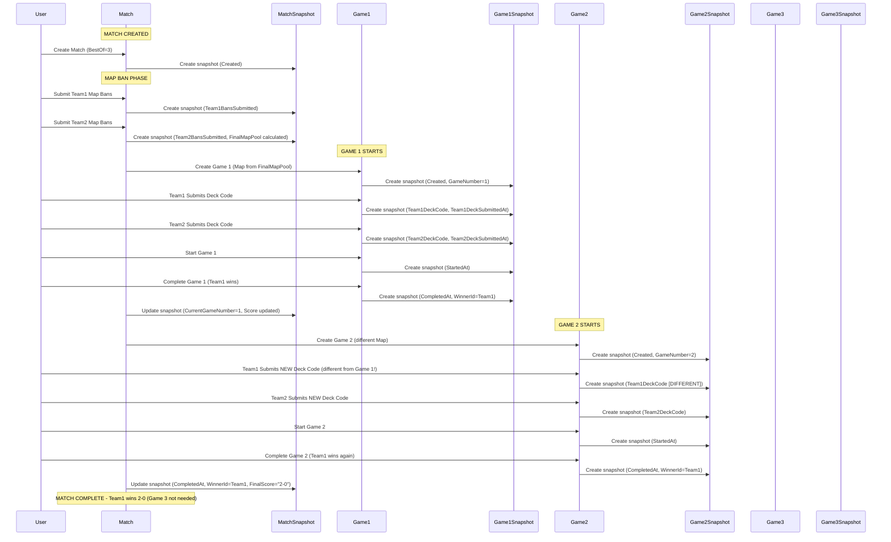
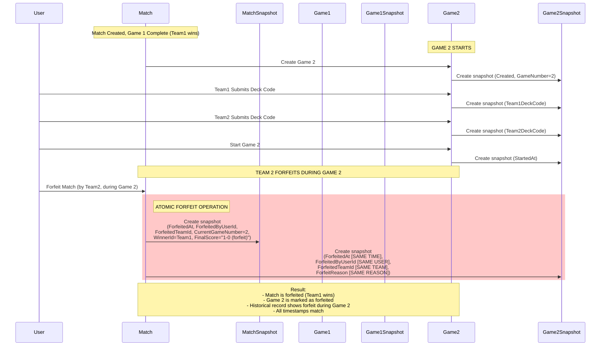
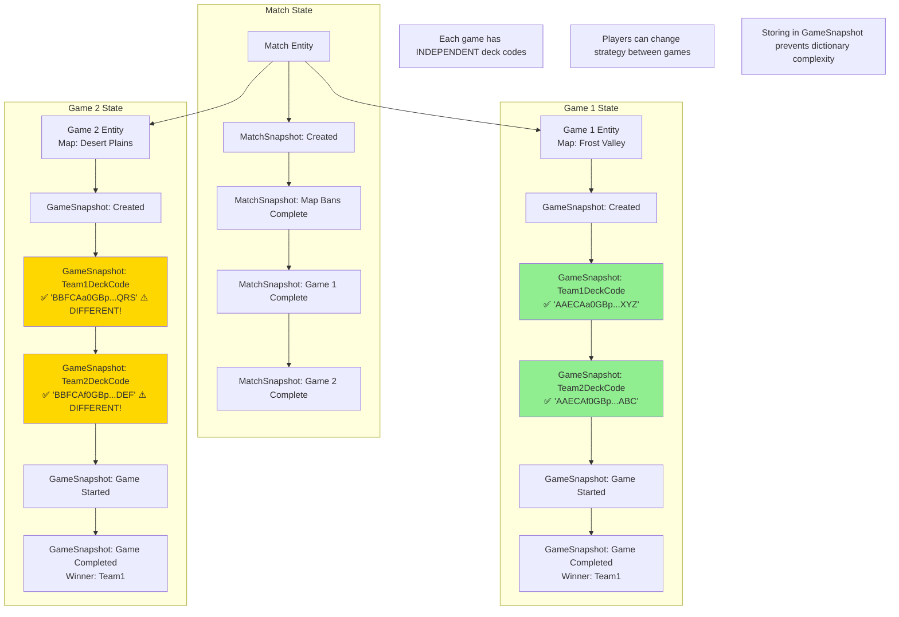
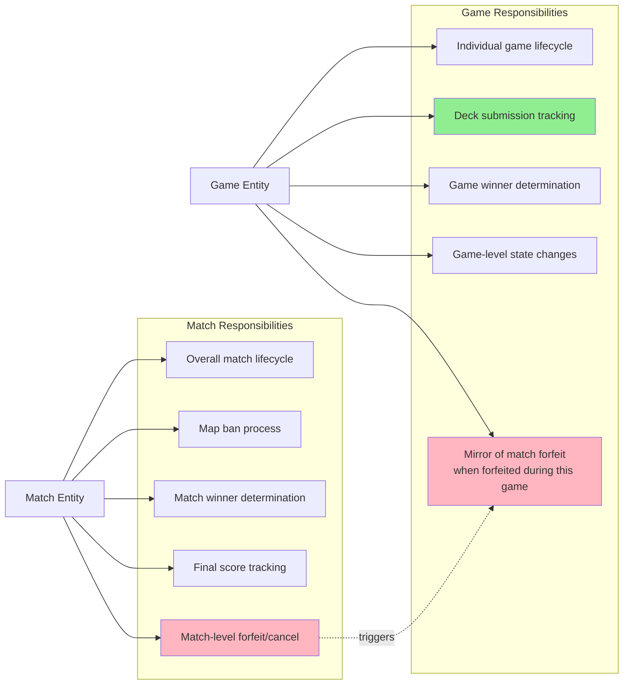

# Match and Game State Flow Diagrams

**Date:** 2025-10-01  
**Purpose:** Visual reference for how state transitions work in matches and games

---

## Design Summary

### Key Principles ✅

1. **Deck codes are per-game** - Stored in `GameStateSnapshot` because players submit new codes for each game
2. **Forfeit properties exist in both entities** - Game forfeit mirrors match forfeit for historical record
3. **Snapshots are denormalized** - Include parent data for archive query performance
4. **Snapshots don't navigate to mutable entities** - Only reference by ID (except explicit navigation properties)

---

## Best of 3 Match Flow



---

## Forfeit During Best of 3 Match



---

## Deck Code Submission Per-Game



---

## Why This Design Works

### ✅ Deck Codes in GameStateSnapshot

**Scenario:** Best of 3 match
```
Game 1: Player uses Aggro deck (AAECAa0GBp...XYZ)
  ↓ Team 1 wins
Game 2: Player switches to Control deck (BBFCAa0GBp...QRS) to counter opponent
  ↓ Team 1 wins
Game 3: Not played (match over)
```

**If deck codes were in MatchStateSnapshot:**
```csharp
// Would need this structure:
public class MatchStateSnapshot 
{
    public Dictionary<int, GameDeckCodes> DeckCodesByGame { get; set; }
}

public class GameDeckCodes 
{
    public string? Team1DeckCode { get; set; }
    public string? Team2DeckCode { get; set; }
    public DateTime? Team1SubmittedAt { get; set; }
    public DateTime? Team2SubmittedAt { get; set; }
    // ... 8 total properties per game
}

// Problems:
// - Complex nested structure
// - Hard to archive (dict of objects)
// - Can't easily query "show me all games where Team1 submitted deck X"
// - Match snapshot caring about game-level details (wrong responsibility)
```

**Current design (GameStateSnapshot):**
```csharp
// Simple, flat structure per game
public class GameStateSnapshot 
{
    public string? Team1DeckCode { get; set; }
    public string? Team2DeckCode { get; set; }
    // ... clear and simple
}

// Benefits:
// ✅ Easy to query: "SELECT * FROM game_state_snapshots WHERE team1_deck_code = 'XXX'"
// ✅ Easy to archive: Just copy rows to archive table
// ✅ Clear responsibility: Game state in game snapshots
// ✅ No dictionary complexity
```

---

### ✅ Forfeit Properties in Both Entities

**Why keep forfeit properties in GameStateSnapshot?**

**Scenario:** Team forfeits during Game 2 of a Best of 5

**Without game forfeit properties:**
```sql
-- Query: "Which game was active when match X was forfeited?"
SELECT current_game_number FROM match_state_snapshots 
WHERE match_id = 'X' AND forfeited_at IS NOT NULL;
-- Returns: 2

-- But then to get game details:
SELECT * FROM games WHERE match_id = 'X' AND game_number = 2;
-- Problem: Game entity might be modified after forfeit
-- Lost historical context of exact state during forfeit
```

**With game forfeit properties:**
```sql
-- Query: "Which game was forfeited in match X?"
SELECT * FROM game_state_snapshots 
WHERE match_id = 'X' AND forfeited_at IS NOT NULL;
-- Returns: Complete snapshot of Game 2 at moment of forfeit

-- Archive query: "Show me all forfeited games in Q4 2024"
SELECT g.game_id, g.match_id, g.forfeited_team_id, g.forfeit_reason
FROM game_state_snapshots_archive g
WHERE g.forfeited_at BETWEEN '2024-10-01' AND '2024-12-31';
-- Works perfectly without joins
```

**Benefits:**
- ✅ Historical completeness - Know exact state when forfeit happened
- ✅ Query performance - No joins needed
- ✅ Archive independence - Archive queries work standalone
- ✅ Clear timeline - Can see progression within forfeited game

---

## State Snapshot Responsibilities



---

## Archive Query Examples

### Query 1: Find all games where specific deck was used
```sql
-- Easy because deck codes are in game_state_snapshots
SELECT 
    gs.game_id,
    gs.match_id,
    gs.game_number,
    gs.team1_deck_code,
    gs.completed_at
FROM game_state_snapshots gs
WHERE gs.team1_deck_code = 'AAECAa0GBp...XYZ'
  AND gs.completed_at IS NOT NULL
ORDER BY gs.completed_at DESC;
```

### Query 2: Find all matches forfeited during Game 2 or later
```sql
-- Easy because forfeit data is in both snapshots
SELECT 
    ms.match_id,
    ms.current_game_number,
    gs.game_id,
    ms.forfeited_team_id,
    ms.forfeit_reason
FROM match_state_snapshots ms
JOIN game_state_snapshots gs 
  ON gs.match_id = ms.match_id 
  AND gs.forfeited_at = ms.forfeited_at  -- Same timestamp
WHERE ms.forfeited_at IS NOT NULL
  AND ms.current_game_number >= 2;
```

### Query 3: Deck submission statistics
```sql
-- Find average time between deck submissions
SELECT 
    game_id,
    AVG(EXTRACT(EPOCH FROM (team2_deck_submitted_at - team1_deck_submitted_at))) as avg_seconds_between
FROM game_state_snapshots
WHERE team1_deck_submitted_at IS NOT NULL
  AND team2_deck_submitted_at IS NOT NULL
  AND team2_deck_submitted_at > team1_deck_submitted_at
GROUP BY game_id;
```

---

## Implementation Notes

### Forfeit Logic Pattern
```csharp
public static class MatchCore 
{
    public static void ForfeitMatch(
        Match match, 
        Guid userId, 
        Guid teamId, 
        string reason)
    {
        var timestamp = DateTime.UtcNow;
        var currentGameNumber = match.CurrentGameNumber;
        
        // 1. Create match forfeit snapshot
        var matchSnapshot = new MatchStateSnapshot
        {
            MatchId = match.Id,
            Timestamp = timestamp,
            UserId = userId.ToString(),
            ForfeitedAt = timestamp,
            ForfeitedByUserId = userId,
            ForfeitedTeamId = teamId,
            ForfeitReason = reason,
            CurrentGameNumber = currentGameNumber,
            WinnerId = teamId == match.Team1Id ? match.Team2Id : match.Team1Id,
            FinalScore = $"{/* calculate score */} (forfeit)"
        };
        match.StateHistory.Add(matchSnapshot);
        
        // 2. Create game forfeit snapshot for active game (if exists)
        var activeGame = match.Games
            .FirstOrDefault(g => g.GameNumber == currentGameNumber);
            
        if (activeGame != null)
        {
            var gameSnapshot = new GameStateSnapshot
            {
                GameId = activeGame.Id,
                Timestamp = timestamp,        // SAME timestamp
                PlayerId = userId,
                ForfeitedAt = timestamp,      // SAME timestamp
                ForfeitedByUserId = userId,   // SAME user
                ForfeitedTeamId = teamId,     // SAME team
                ForfeitReason = reason,       // SAME reason
                
                // Denormalized data for historical completeness
                MatchId = match.Id,
                MapId = activeGame.MapId,
                TeamSize = activeGame.TeamSize,
                GameNumber = activeGame.GameNumber,
                // ... etc
            };
            activeGame.StateHistory.Add(gameSnapshot);
        }
    }
}
```

---

## Summary

| Question | Answer | Rationale |
|----------|--------|-----------|
| Where should deck codes be stored? | ✅ GameStateSnapshot | Per-game state, avoids dictionary complexity, easier to archive and query |
| Should game have forfeit properties? | ✅ Yes, as mirror of match forfeit | Historical completeness, query performance, archive independence |
| Should we keep denormalized data in GameStateSnapshot? | ✅ Yes (MatchId, MapId, etc.) | Historical completeness, query performance, works without joins |
| Should MatchStateSnapshot navigate to Games? | ❌ No, already removed | Snapshots are immutable, shouldn't navigate to mutable entities |
| Can game forfeit be set independently? | ❌ No, always via match forfeit | Forfeiting game = forfeiting match, properties mirror for historical record |

---

## Design Validation ✅

The current design after optimization:

1. **Clear Responsibility Separation** ✅
   - Match owns match-level state
   - Game owns game-level state
   - No crossing of boundaries

2. **Historical Completeness** ✅
   - Snapshots contain all data needed for reconstruction
   - Archive queries work without joins
   - Timeline is clear and complete

3. **Query Performance** ✅
   - Denormalized data enables direct queries
   - No complex dictionary structures
   - Simple, flat table structure

4. **Maintenance** ✅
   - Clear documentation of design decisions
   - Inline comments explain rationale
   - Implementation patterns documented

5. **Flexibility** ✅
   - Supports any BestOf value (1, 3, 5, 7, etc.)
   - Deck codes can change per game
   - Historical queries remain fast

