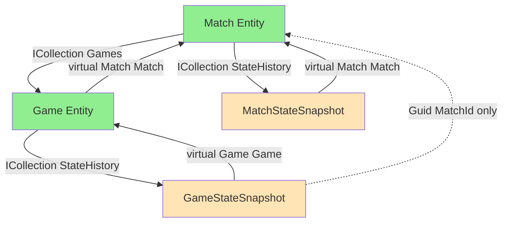

# Navigation Analysis: Match/Game State Management

**Date:** 2025-10-01  
**Purpose:** Analyze navigation properties for efficient match/game state processing

---

## Current Navigation Structure

### ✅ What Exists



### Navigation Matrix

| From | To | Navigation Property | Status |
|------|----|--------------------|--------|
| Match | Game | `ICollection<Game> Games` | ✅ Exists |
| Game | Match | `virtual Match Match` | ✅ Exists |
| Match | MatchStateSnapshot | `ICollection<MatchStateSnapshot> StateHistory` | ✅ Exists |
| MatchStateSnapshot | Match | `virtual Match Match` | ✅ Exists |
| Game | GameStateSnapshot | `ICollection<GameStateSnapshot> StateHistory` | ✅ Exists |
| GameStateSnapshot | Game | `virtual Game Game` | ✅ Exists |
| GameStateSnapshot | Match | Only `Guid MatchId` | ⚠️ **MISSING** |
| MatchStateSnapshot | Game | Nothing (correct) | ✅ N/A |

---

## Common Match Processing Scenarios

### Scenario 1: Game Completion Updates Match State

**Current Code:**
```csharp
public static void CompleteGame(Game game, Guid winnerId)
{
    // 1. Create game completion snapshot
    var gameSnapshot = new GameStateSnapshot
    {
        GameId = game.Id,
        CompletedAt = DateTime.UtcNow,
        WinnerId = winnerId,
        // ... other properties
    };
    game.StateHistory.Add(gameSnapshot);
    
    // 2. Navigate to Match to update match state
    var match = game.Match; // ✅ Direct navigation exists
    
    // 3. Check if match is complete
    var gamesWonByTeam1 = match.Games
        .Where(g => g.StateHistory.Any(s => s.WinnerId == match.Team1Id))
        .Count();
    
    var gamesNeededToWin = (match.BestOf / 2) + 1;
    
    if (gamesWonByTeam1 >= gamesNeededToWin)
    {
        // 4. Create match completion snapshot
        var matchSnapshot = new MatchStateSnapshot
        {
            MatchId = match.Id,
            CompletedAt = DateTime.UtcNow,
            WinnerId = match.Team1Id,
            FinalScore = $"{gamesWonByTeam1}-{match.Games.Count - gamesWonByTeam1}",
        };
        match.StateHistory.Add(matchSnapshot);
    }
}
```

**Navigation used:** 
- ✅ `game.Match` - Exists
- ✅ `match.Games` - Exists
- ✅ `game.StateHistory` - Exists
- ✅ `match.StateHistory` - Exists

**Status:** ✅ **Works well with current structure**

---

### Scenario 2: Match Forfeit Creates Both Match and Game Snapshots

**Current Code:**
```csharp
public static void ForfeitMatch(Match match, Guid userId, Guid teamId, string reason)
{
    var timestamp = DateTime.UtcNow;
    var currentGameNumber = GetCurrentGameNumber(match);
    
    // 1. Create match forfeit snapshot
    var matchSnapshot = new MatchStateSnapshot
    {
        MatchId = match.Id,
        Timestamp = timestamp,
        ForfeitedAt = timestamp,
        ForfeitedByUserId = userId,
        ForfeitedTeamId = teamId,
        ForfeitReason = reason,
        CurrentGameNumber = currentGameNumber,
        WinnerId = teamId == match.Team1Id ? match.Team2Id : match.Team1Id,
    };
    match.StateHistory.Add(matchSnapshot);
    
    // 2. Find active game and create game forfeit snapshot
    var activeGame = match.Games // ✅ Direct navigation exists
        .FirstOrDefault(g => g.GameNumber == currentGameNumber);
    
    if (activeGame != null)
    {
        var gameSnapshot = new GameStateSnapshot
        {
            GameId = activeGame.Id,
            Timestamp = timestamp,
            ForfeitedAt = timestamp,
            ForfeitedByUserId = userId,
            ForfeitedTeamId = teamId,
            ForfeitReason = reason,
            
            // Denormalized data
            MatchId = match.Id, // ✅ Can use match.Id
            GameNumber = activeGame.GameNumber,
            // ... etc
        };
        activeGame.StateHistory.Add(gameSnapshot);
    }
}
```

**Navigation used:**
- ✅ `match.Games` - Exists
- ✅ `match.StateHistory` - Exists  
- ✅ `activeGame.StateHistory` - Exists

**Status:** ✅ **Works well with current structure**

---

### Scenario 3: Processing GameStateSnapshot (Archive/Query Context)

**Current Code:**
```csharp
// Query: Get match context from a game snapshot
public static MatchInfo GetMatchContextFromGameSnapshot(Guid snapshotId)
{
    var snapshot = GetGameStateSnapshot(snapshotId);
    
    // Option 1: Two-hop navigation
    var match = snapshot.Game.Match; // ❌ Requires loading Game entity first
    
    // Option 2: Separate query using denormalized MatchId
    var match = GetMatch(snapshot.MatchId); // ✅ Direct, but separate query
    
    // Option 3: If we had direct navigation
    // var match = snapshot.Match; // ⚠️ Doesn't exist
    
    return new MatchInfo
    {
        MatchId = match.Id,
        BestOf = match.BestOf,
        CurrentGameNumber = snapshot.GameNumber,
        // ... etc
    };
}
```

**Issue:** 
- ⚠️ Need to load `Game` entity just to navigate to `Match`
- ⚠️ Or make a separate query for `Match` using `snapshot.MatchId`

**Status:** ⚠️ **Could be improved**

---

### Scenario 4: Event Processing (GameCompleted → Update Match)

**Current Code:**
```csharp
// Event handler receiving GameStateSnapshot from event bus
public async Task Handle(GameCompletedEvent evt)
{
    // Event only contains snapshot ID
    var gameSnapshot = await GetGameStateSnapshot(evt.SnapshotId);
    
    // Need match context to determine if match is complete
    // Current options:
    
    // Option A: Load Game to navigate to Match (two hops)
    var game = gameSnapshot.Game;
    var match = game.Match;
    
    // Option B: Separate query using MatchId
    var match = await GetMatch(gameSnapshot.MatchId);
    
    // Then check if match should be completed
    var allGames = await GetGamesForMatch(match.Id);
    var team1Wins = allGames.Count(g => g.StateHistory
        .OrderByDescending(s => s.Timestamp)
        .First()
        .WinnerId == match.Team1Id);
    
    if (team1Wins >= (match.BestOf / 2) + 1)
    {
        // Complete match
        CompleteMatch(match, match.Team1Id);
    }
}
```

**Issue:**
- ⚠️ Event-driven architecture often works with snapshots, not entities
- ⚠️ Frequently need match context from game snapshots
- ⚠️ Two-hop navigation or separate queries required

**Status:** ⚠️ **Could benefit from direct navigation**

---

## Analysis: Should GameStateSnapshot Navigate to Match?

### 🔍 Current Workarounds

1. **Two-hop navigation:** `gameSnapshot.Game.Match`
   - ❌ Requires loading intermediate `Game` entity
   - ❌ More expensive database query
   - ❌ Can fail if `Game` is not loaded (lazy loading issues)

2. **Separate query:** `GetMatch(gameSnapshot.MatchId)`
   - ✅ Direct and efficient
   - ❌ Requires separate database round-trip
   - ❌ Need to explicitly load Match

3. **Denormalized data:** Use `snapshot.MatchId` and duplicate match properties
   - ✅ No navigation needed
   - ❌ Data duplication
   - ❌ Already have MatchId, but still need other Match properties

---

### ✅ Benefits of Adding `GameStateSnapshot → Match` Navigation

```csharp
public class GameStateSnapshot : Entity, IMatchEntity
{
    // ... existing properties ...
    
    // Add direct navigation to Match
    public virtual Match Match { get; set; } = null!;
}
```

**Benefits:**

1. **Event Processing Efficiency**
   ```csharp
   // Before:
   var gameSnapshot = GetGameStateSnapshot(id);
   var match = gameSnapshot.Game.Match; // Two hops
   
   // After:
   var gameSnapshot = GetGameStateSnapshot(id);
   var match = gameSnapshot.Match; // Direct!
   ```

2. **Query Simplification**
   ```csharp
   // Query snapshots with match context
   var snapshots = await context.GameStateSnapshots
       .Include(gs => gs.Match) // ✅ Direct include
       .Where(gs => gs.Match.BestOf == 3)
       .ToListAsync();
   
   // Instead of:
   var snapshots = await context.GameStateSnapshots
       .Include(gs => gs.Game)
           .ThenInclude(g => g.Match) // ❌ Two-level include
       .Where(gs => gs.Game.Match.BestOf == 3)
       .ToListAsync();
   ```

3. **State Processing Logic**
   ```csharp
   public static void ProcessGameState(GameStateSnapshot snapshot)
   {
       var match = snapshot.Match; // ✅ Direct access
       
       // Check if this was the winning game
       if (snapshot.WinnerId != null)
       {
           var gamesNeeded = (match.BestOf / 2) + 1;
           var teamWins = match.Games
               .Count(g => GetLatestSnapshot(g).WinnerId == snapshot.WinnerId);
           
           if (teamWins >= gamesNeeded)
           {
               CompleteMatch(match, snapshot.WinnerId.Value);
           }
       }
   }
   ```

4. **Consistency with Other Snapshots**
   - `MatchStateSnapshot` has `virtual Match Match` ✅
   - `GameStateSnapshot` has `virtual Game Game` ✅
   - Adding `virtual Match Match` creates consistency ✅

---

### ⚠️ Potential Concerns

1. **Redundant Navigation?**
   - Already can navigate: `GameSnapshot → Game → Match`
   - **Counter:** Two-hop navigation is inefficient and error-prone

2. **More EF Relationships?**
   - Creates another relationship in DbContext
   - **Counter:** EF Core handles this well, and MatchId already exists

3. **Violates Snapshot Independence?**
   - Snapshots navigating "up" to parent entities
   - **Counter:** We already navigate to `Game`, and `Match` is just as much a parent

4. **Database Overhead?**
   - Additional foreign key (but MatchId already exists!)
   - **Counter:** No additional storage, just navigation property

---

## Recommendation

### ✅ **ADD `Match` Navigation to `GameStateSnapshot`**

**Reasoning:**

1. **Match proceedings are inherently bidirectional**
   - Game events → trigger Match state updates
   - Match events → trigger Game state updates
   - Direct navigation reduces friction

2. **Common access pattern in your domain**
   - Forfeit: Match → Game snapshots
   - Completion: Game snapshot → Match state check
   - Event processing: Game snapshot → Match context

3. **Performance improvement**
   - Avoids two-hop navigation
   - Simplifies queries (one Include vs ThenInclude)
   - Better for event-driven architecture

4. **Consistency**
   - Mirrors existing patterns
   - GameStateSnapshot already has denormalized MatchId
   - Just adds the navigation property

5. **No significant downsides**
   - MatchId already exists (no schema change)
   - Navigation properties are "free" (no storage cost)
   - EF Core handles relationships well

---

## Proposed Changes

### 1. Add Navigation Property

```csharp
public class GameStateSnapshot : Entity, IMatchEntity
{
    // ... existing properties ...
    
    // Add direct navigation to parent Match (in addition to Game)
    // This enables efficient access to match context during game state processing
    public virtual Match Match { get; set; } = null!;
    
    // Existing properties
    public Guid MatchId { get; set; } // FK already exists
    public virtual Game Game { get; set; } = null!;
}
```

### 2. Update DbContext Configuration (if needed)

The source generator should handle this automatically since `MatchId` already exists and is properly named. But verify the generated configuration:

```csharp
// Expected generated config:
entity.HasOne(e => e.Match)
    .WithMany()
    .HasForeignKey(e => e.MatchId)
    .OnDelete(DeleteBehavior.Cascade);
```

---

## Updated Navigation Matrix

| From | To | Navigation Property | Status | Use Case |
|------|----|--------------------|--------|----------|
| Match | Game | `ICollection<Game> Games` | ✅ Exists | Iterate games in match |
| Game | Match | `virtual Match Match` | ✅ Exists | Access parent match from game |
| Match | MatchStateSnapshot | `ICollection<MatchStateSnapshot> StateHistory` | ✅ Exists | Iterate match state history |
| MatchStateSnapshot | Match | `virtual Match Match` | ✅ Exists | Access match from snapshot |
| Game | GameStateSnapshot | `ICollection<GameStateSnapshot> StateHistory` | ✅ Exists | Iterate game state history |
| GameStateSnapshot | Game | `virtual Game Game` | ✅ Exists | Access game from snapshot |
| GameStateSnapshot | Match | `virtual Match Match` | 🆕 **ADD THIS** | Access match context from game snapshot |

---

## Code Examples With New Navigation

### Example 1: Event Handler (Simplified)

```csharp
// Before:
public async Task Handle(GameCompletedEvent evt)
{
    var snapshot = await GetGameStateSnapshot(evt.SnapshotId);
    var game = snapshot.Game; // First hop
    var match = game.Match;   // Second hop
    
    // Process...
}

// After:
public async Task Handle(GameCompletedEvent evt)
{
    var snapshot = await GetGameStateSnapshot(evt.SnapshotId);
    var match = snapshot.Match; // ✅ Direct!
    
    // Process...
}
```

### Example 2: Complex Query (Simplified)

```csharp
// Before:
var forfeitedGames = context.GameStateSnapshots
    .Include(gs => gs.Game)
        .ThenInclude(g => g.Match) // Two-level include
    .Where(gs => gs.ForfeitedAt != null)
    .Where(gs => gs.Game.Match.BestOf == 3)
    .ToListAsync();

// After:
var forfeitedGames = context.GameStateSnapshots
    .Include(gs => gs.Match) // ✅ One-level include
    .Where(gs => gs.ForfeitedAt != null)
    .Where(gs => gs.Match.BestOf == 3)
    .ToListAsync();
```

### Example 3: Forfeit Logic (Cleaner)

```csharp
public static void ProcessForfeit(GameStateSnapshot gameSnapshot)
{
    // Verify this is actually a forfeit
    if (gameSnapshot.ForfeitedAt == null)
        return;
    
    // Direct access to match context
    var match = gameSnapshot.Match; // ✅ Clean!
    
    // Determine winner (opposite of forfeiting team)
    var winnerId = gameSnapshot.ForfeitedTeamId == match.Team1Id 
        ? match.Team2Id 
        : match.Team1Id;
    
    // Create match forfeit snapshot
    var matchSnapshot = new MatchStateSnapshot
    {
        MatchId = match.Id,
        ForfeitedAt = gameSnapshot.ForfeitedAt,
        ForfeitedByUserId = gameSnapshot.ForfeitedByUserId,
        WinnerId = winnerId,
        // ... etc
    };
    
    match.StateHistory.Add(matchSnapshot);
}
```

---

## Summary

### Current State: ✅ Functional but Could Be Better

The existing navigation structure works, but requires:
- Two-hop navigation (`GameSnapshot → Game → Match`)
- Separate queries when you have snapshot but need match context
- More complex EF Core queries (ThenInclude)

### Proposed State: ✅ Optimized for Match Proceedings

Adding `GameStateSnapshot.Match` navigation provides:
- Direct one-hop navigation
- Simpler queries and cleaner code
- Better performance in event-driven scenarios
- Consistency with existing patterns

### Recommendation: ✅ **ADD THE NAVIGATION PROPERTY**

**Change Required:**
```csharp
public class GameStateSnapshot : Entity, IMatchEntity
{
    // Add this line:
    public virtual Match Match { get; set; } = null!;
    
    // Keep existing:
    public Guid MatchId { get; set; }
    public virtual Game Game { get; set; } = null!;
}
```

This is a low-risk, high-value change that better reflects the bidirectional nature of match/game state processing in your domain.

