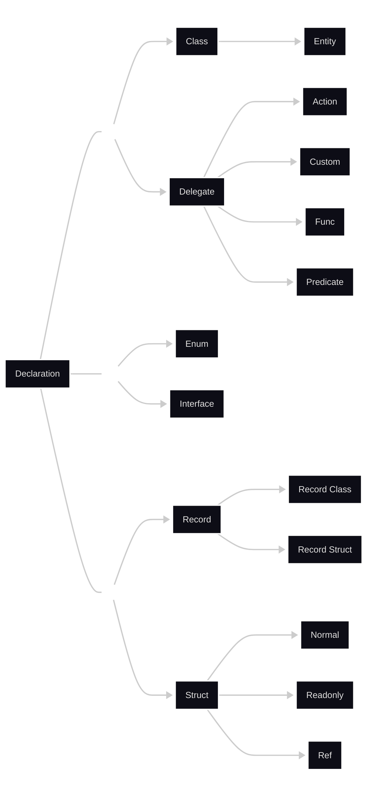

```mermaid
---
config:
  layout: dagre
  theme: redux-dark
  look: neo
---
flowchart LR
 subgraph subGraphBottom[" "]
 end
 subgraph subGraphStruct[" "]
        Normal["Normal"]
        Readonly["Readonly"]
        Ref["Ref"]
        Struct["Struct"]
  end
 subgraph subGraphRecord[" "]
        Record["Record"]
        RecordClass["Record Class"]
        RecordStruct["Record Struct"]
  end
 subgraph subGraphEnumInterface[" "]
        Enum["Enum"]
        Interface["Interface"]
  end
 subgraph subGraphMiddle[" "]
 end
 subgraph subGraphClassDelegate[" "]
        Class["Class"]
        Delegate["Delegate"]
  end
 subgraph subGraphClassDelegateSubtypes[" "]
        Entity["Entity"]
        Action["Action"]
        Custom["Custom"]
        Func["Func"]
        Predicate["Predicate"]
  end
 subgraph subGraphTop[" "]
 end
    Declaration["Declaration"] --- subGraphTop
    subGraphTop --> Class --> Entity
    subGraphTop --> Delegate
    Declaration["Declaration"] --- subGraphMiddle
    subGraphMiddle --> Enum
    subGraphMiddle --> Interface
    Declaration["Declaration"] --- subGraphBottom
    subGraphBottom --> Record
    subGraphBottom --> Struct
    Struct --> Normal & Readonly & Ref
    Record --> RecordClass & RecordStruct
    Delegate --> Action & Custom & Func & Predicate
    style subGraphStruct fill:transparent,stroke:none
    style subGraphRecord fill:transparent,stroke:none
    style subGraphEnumInterface fill:transparent,stroke:none
    style subGraphTop fill:transparent,stroke:none
    style subGraphMiddle fill:transparent,stroke:none
    style subGraphBottom fill:transparent,stroke:none
    style subGraphClassDelegateSubtypes fill:transparent,stroke:none
    style subGraphClassDelegate fill:transparent,stroke:none
```