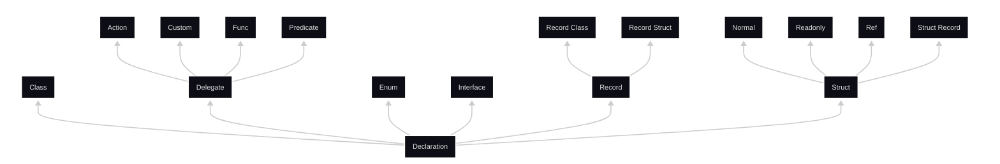
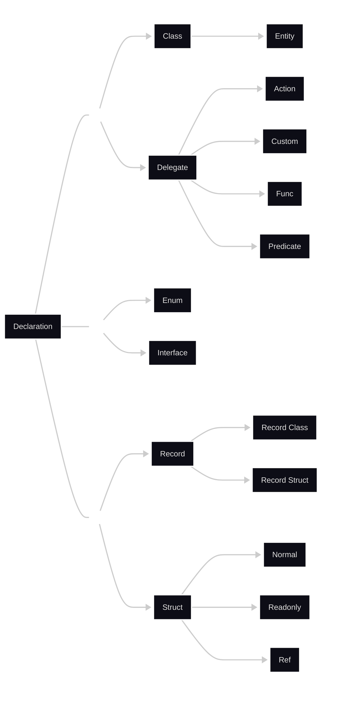

# standard mermaid flowchart

# Uses invisible Bottom/Middle/Top subgraphs to maintain alphabetical order


### Explanations of C# Declaration Types

Below is a detailed explanation of all the terminology and types mentioned in your hierarchy. I've structured this as a reference guide, focusing on their purposes, characteristics, and usage in C#. This includes both the types you have experience with and those you marked as having no experience. Explanations are based on standard C# language features (as of C# 12 and earlier, since the current date is September 20, 2025, and no major changes have occurred post-C# 12 that affect these fundamentals).

#### 1. **declaration**
   - **Purpose**: This is the root concept in your hierarchy, representing the broad category of type declarations in C#. In C#, a "declaration" refers to the definition of types, variables, methods, or other members in code. Specifically for types, declarations define blueprints for data structures or behaviors. All subtypes (like enum, class, etc.) fall under this as ways to declare custom types. Declarations help organize code, enable reuse, and support object-oriented programming principles like inheritance and polymorphism.

#### 2. **declaration.enum** (abbreviated as "enum" in the diagram)
   - **Purpose**: An enum (enumeration) is a value type that defines a set of named constants, typically representing a group of related integer values. It's used to make code more readable and maintainable by assigning meaningful names to numeric values (e.g., days of the week as `Monday`, `Tuesday`, etc.). Enums are implicitly based on integers but can be based on other integral types like byte or long. They don't support methods or complex logic but are ideal for switch statements or flags.

#### 3. **declaration.class** (abbreviated as "class" in the diagram)
   - **Purpose**: A class is a reference type that serves as a blueprint for creating objects. It encapsulates data (fields/properties) and behavior (methods). Classes support inheritance, polymorphism, and interfaces, making them central to object-oriented design. They are allocated on the heap and passed by reference. Common uses include modeling real-world entities (e.g., a `Person` class with name and age properties).

#### 4. **declaration.interface** (abbreviated as "interface" in the diagram)
   - **Purpose**: An interface defines a contract of methods, properties, events, or indexers that implementing types must provide. It doesn't contain implementation details—only signatures. Interfaces enable polymorphism and loose coupling, allowing different classes to be treated uniformly if they implement the same interface (e.g., `IEnumerable` for collections). They are reference types and support multiple inheritance.

#### 5. **declaration.record** (abbreviated as "record" in the diagram)
   - **Purpose**: Introduced in C# 9, a record is a concise way to declare immutable data types focused on value equality (comparing contents rather than references). Records automatically provide equality operators, hashing, and deconstruction. They are useful for data transfer objects (DTOs) or immutable models where the primary role is holding data. Records can be either classes (reference types) or structs (value types), combining the benefits of both with less boilerplate code.

#### 6. **record.class** (abbreviated as "class" under "record" in the diagram)
   - **Purpose**: A record class is a reference-type record. It behaves like a class but with built-in value semantics for equality and immutability by default (properties are init-only). It's suitable for scenarios where you need reference-type behavior (e.g., nullability, inheritance) but want automatic equality checks. For example, modeling complex immutable objects like configuration settings.

#### 7. **record.struct** (abbreviated as "struct" under "record" in the diagram)
   - **Purpose**: A record struct is a value-type record, combining the features of structs (stack allocation, pass-by-value) with record's value equality and immutability. Introduced in C# 10, it's ideal for small, immutable data structures that benefit from performance optimizations (e.g., avoiding heap allocation). Use it for types like coordinates or simple value holders where copying is cheap.

#### 8. **declaration.struct** (abbreviated as "struct" in the diagram)
   - **Purpose**: A struct is a value type that represents lightweight data structures. Unlike classes, structs are allocated on the stack (or inline in arrays) and passed by value, which can improve performance for small types. They don't support inheritance (except from interfaces) and are mutable by default. Structs are used for simple types like `Point` or `DateTime`, where the overhead of reference types is unnecessary.

#### 9. **struct.normal** (abbreviated as "normal" under "struct" in the diagram)
   - **Purpose**: This refers to a standard (mutable) struct without modifiers like readonly or ref. It's the default form, allowing fields to be modified after creation. Useful for performance-critical code where mutability is needed, such as in game development for vectors or matrices that change frequently.

#### 10. **struct.readonly** (abbreviated as "readonly" under "struct" in the diagram)
   - **Purpose**: A readonly struct (introduced in C# 7.2) ensures the struct is immutable—all instance members are readonly, and it can't be modified after initialization. This allows compiler optimizations (e.g., defensive copies avoidance) and signals intent for thread-safety. It's great for types like immutable configurations or math primitives where changes shouldn't occur.

#### 11. **struct.record** (abbreviated as "record" under "struct" in the diagram)
   - **Purpose**: This is synonymous with record struct (see above). It's a readonly struct by default with value equality semantics. It provides a shorthand for declaring immutable value types with automatic implementations for equality, ToString, and more.

#### 12. **struct.ref** (abbreviated as "ref" under "struct" in the diagram)
   - **Purpose**: A ref struct (introduced in C# 7.2) is a struct that can only be allocated on the stack and cannot be boxed or used in async methods/lambdas. It's designed for high-performance scenarios, like spans (`Span<T>`) or stackalloc, to avoid heap allocations entirely. Ref structs prevent escaping to the heap, ensuring safety in performance-critical code like parsing or buffer management.

#### 13. **declaration.delegate** (abbreviated as "delegate" in the diagram)
   - **Purpose**: A delegate is a reference type that represents a method signature, acting as a type-safe function pointer. It allows methods to be passed as parameters, enabling callbacks, events, and functional programming. Delegates are the foundation for events in C# and support multicast (multiple methods invoked via one delegate).

#### 14. **delegate.custom** (abbreviated as "custom" under "delegate" in the diagram)
   - **Purpose**: A custom delegate is a user-defined delegate type declared with the `delegate` keyword, specifying a custom signature (e.g., `delegate int MyDelegate(string input);`). It's used when built-in delegates like Action or Func don't match the required signature, providing flexibility for specific method references.

#### 15. **delegate.action** (abbreviated as "action" under "delegate" in the diagram)
   - **Purpose**: Action is a built-in generic delegate in `System` namespace for methods that return void and take 0 to 16 parameters (e.g., `Action<int>` for a method taking an int). It's commonly used for callbacks without return values, like in event handlers or LINQ methods.

#### 16. **delegate.func** (abbreviated as "func" under "delegate" in the diagram)
   - **Purpose**: Func is a built-in generic delegate for methods that return a value and take 0 to 16 parameters (e.g., `Func<int, string>` for a method taking int and returning string). It's essential for functional programming, lambdas, and APIs like async tasks or LINQ projections.

#### 17. **delegate.predicate** (abbreviated as "predicate" under "delegate" in the diagram)
   - **Purpose**: Predicate is a built-in generic delegate (`Predicate<T>`) for methods that take one parameter and return a bool, used for testing conditions. It's common in filtering operations, like `List<T>.FindAll` or LINQ Where clauses, to define custom conditions.


----

### 1. Immutable vs Mutable Data Types and Value Equality

- **Immutable Data Types**: These are types where the state (i.e., the data they hold) cannot be changed after the object is created. Once initialized, their properties or fields are fixed and read-only. This promotes thread-safety (since no modifications can occur concurrently), reduces bugs from unintended changes, and makes reasoning about code easier. In C#, immutability is often achieved with keywords like `readonly` or init-only properties. For example, strings in C# are immutable—any "modification" actually creates a new string.

- **Mutable Data Types**: In contrast, these allow their state to be modified after creation. Fields or properties can be reassigned, which is useful for objects that need to evolve over time (e.g., a counter that increments). However, mutability can lead to side effects, like unexpected changes in shared objects, making code harder to debug or parallelize.

- **Value Equality**: This refers to comparing two objects based on their actual data (contents) rather than their identity (memory location). For immutable types, value equality is particularly useful because the data doesn't change, so equality checks are reliable and consistent. In C#, value equality is the default for structs and records, meaning two instances are equal if their fields match, even if they are separate objects. This contrasts with reference equality, which checks if two variables point to the same object in memory.

These concepts are key for records (which default to immutable with value equality) and structs (which can be mutable or immutable).

### 2. Comparing Contents Rather Than References

- **Comparing Contents (Value Semantics)**: This means equality is determined by inspecting the actual values stored in the object's fields or properties. For example, if you have two `Point` structs with X=5 and Y=10, they are considered equal because their contents match, regardless of whether they were created separately. This is efficient for value types like structs and records, as it focuses on data equivalence.

- **Comparing References (Reference Semantics)**: This checks if two variables refer to the exact same object in memory (i.e., same reference or pointer). Even if two objects have identical data, they are not equal if they occupy different memory locations. This is the default for classes in C#, where `==` typically performs reference equality unless overridden.

Records in C# emphasize content comparison (value equality) by automatically implementing it, bridging the gap between classes (which use reference semantics) and structs (which use value semantics). This makes records ideal for data-focused types where "sameness" is about the data, not the instance.

### 3. Equality Operators, Hashing, and Deconstruction

- **Equality Operators**: These include `==` (equal) and `!=` (not equal). For custom types, you can override them to define what "equal" means. Records automatically generate these to perform value equality (comparing contents field-by-field), saving boilerplate code. For example, two record instances with the same property values will return true for `==`.

- **Hashing**: This involves generating a hash code (an integer) from an object's state via the `GetHashCode()` method. It's crucial for using objects as keys in dictionaries or hash sets, where fast lookups rely on consistent hashing. Records auto-implement `GetHashCode()` based on their fields, ensuring that equal objects produce the same hash code (following the rule: if A equals B, then A.GetHashCode() == B.GetHashCode()).

- **Deconstruction**: This is a feature allowing an object to be broken down into its components, often via a `Deconstruct` method. It's used in pattern matching or tuple-like syntax, e.g., `(var x, var y) = point;`. Records automatically provide deconstruction based on their primary constructor parameters, making it easy to extract values without extra code.

These features are auto-generated for records to reduce verbosity, ensuring consistent behavior for equality and usability in collections or patterns.

### 4. DTOs, Stack vs. Heap, and Inline Arrays

- **DTOs (Data Transfer Objects)**: These are simple classes or structs designed to carry data between processes or layers in an application (e.g., from a database to a UI). They typically have no behavior, just properties for data. Records are perfect for DTOs because of their conciseness, immutability (preventing accidental changes during transfer), and built-in equality for comparisons.

- **Stack vs. Heap**: In memory management, the stack is a fast, limited area for local variables and value types (like structs), allocated automatically and deallocated when out of scope (no garbage collection needed). The heap is for reference types (like classes), dynamically allocated with more space but slower access and requiring garbage collection to free memory. Structs use stack allocation for performance in small, short-lived data, while classes use the heap for larger, longer-lived objects.

- **Inline Arrays**: This refers to arrays embedded directly within a struct or allocated inline (e.g., in a larger array), avoiding separate heap allocations. In C#, fixed-size arrays in structs (using `unsafe` or spans) can be inline, improving cache locality and performance by keeping data contiguous in memory without pointers.

These distinctions explain why record structs (value types, stack-friendly) are chosen for performance in small data scenarios, while record classes (reference types, heap-allocated) suit more complex DTOs with inheritance.

### 5. Spans, Stackalloc, Heap Allocations, Buffer Management

- **Spans (`Span<T>`)**: A ref struct representing a contiguous region of memory (array, stack, or heap). It provides a unified way to work with memory without copying, enabling efficient slicing and manipulation. Spans are stack-only, preventing heap escape for safety and performance in scenarios like string parsing or array subsets.

- **Stackalloc**: A keyword for allocating arrays directly on the stack (e.g., `stackalloc int[10];`), which is faster than heap allocation and auto-deallocates. It's limited to small sizes to avoid stack overflow and is often used with spans for high-performance code.

- **Heap Allocations**: Creating objects on the heap via `new` (for classes or large arrays), which involves runtime overhead for memory management and garbage collection. Excessive allocations can cause performance issues like GC pauses, so avoiding them (via stack or pooling) is key in optimized code.

- **Buffer Management**: This involves handling memory buffers (arrays or spans) efficiently, such as renting from pools (e.g., `ArrayPool<T>`) to reuse memory and reduce allocations. It's critical in I/O, networking, or data processing to minimize GC pressure and improve throughput.

Ref structs in C# enforce stack-only allocation to support these high-performance patterns, ensuring no heap allocations occur in critical paths like buffer handling or parsing large data without copying.

### 6. Polymorphism

Polymorphism is a core principle in object-oriented programming (OOP) that allows objects of different types to be treated as objects of a common base type, while still executing type-specific behavior. The term comes from Greek, meaning "many forms," and it enables code to work with a variety of related types without knowing their exact concrete type at compile time. In C#, polymorphism is primarily achieved through inheritance (where derived classes override base class methods) and interfaces (where multiple classes implement the same contract).

There are two main forms:
- **Compile-time (Static) Polymorphism**: Also known as method overloading, where multiple methods in the same class have the same name but different parameters. The compiler decides which method to call based on the arguments (e.g., `Add(int a, int b)` vs. `Add(double a, double b)`).
- **Run-time (Dynamic) Polymorphism**: This uses virtual/override methods or interfaces. A base class reference can point to a derived class object, and the correct method is called at runtime via the virtual method table (vtable). For example, a base `Shape` class with a virtual `Draw()` method can be overridden in `Circle` and `Square` subclasses. Calling `Draw()` on a `Shape` reference will invoke the appropriate implementation based on the actual object type.

Polymorphism promotes flexibility, extensibility, and code reuse—e.g., in collections like `List<Shape>` where you can iterate and call `Draw()` on mixed shapes. In the context of C# declarations like classes and interfaces, it's what makes them powerful for OOP designs, allowing loose coupling and adherence to principles like Liskov Substitution (subtypes can replace base types without breaking the program).

### 7. Definition for the Class Declaration Type More Suited for Procedural Programming Instead of Object-Oriented Programming

In the hierarchy of C# declaration types, the type most suited for procedural programming (which emphasizes procedures/functions operating on data, rather than encapsulating data and behavior in objects as in OOP) is the **struct** (specifically, the "normal" or mutable struct variant). 

- **Definition and Suitability**: A struct is a value type that primarily holds data with minimal or no behavior, making it akin to a simple data container or record in procedural languages. It doesn't support full inheritance (only interfaces), which reduces OOP complexity like polymorphism or deep hierarchies. Structs are passed by value (copied when assigned or passed to methods), encouraging a functional/procedural style where data is manipulated through standalone functions rather than instance methods that modify internal state. They are lightweight, stack-allocated for performance, and mutable by default, allowing direct field modifications without the object-oriented overhead of references or garbage collection. This aligns with procedural programming's focus on efficiency and straightforward data processing, as seen in languages like C, where structs (or equivalents) store data that procedures act upon externally.

For example, in procedural code, you might define a `struct Point { public int X; public int Y; }` and write global/static methods like `void MovePoint(ref Point p, int dx, int dy)` to operate on it, rather than making `Move` an instance method as in OOP. While C# is inherently OOP-oriented, structs allow emulating procedural patterns in performance-critical or data-heavy scenarios, like math utilities or simple aggregates, without the reference semantics of classes.

### 8. What a Callback Is, and a More Rudimentary Explanation of the Use of Delegates, with Examples for Your Application

- **What a Callback Is**: A callback is essentially a function or method that you pass to another piece of code (like a library or system) so it can "call back" to your code at a specific time or event. It's like handing someone your phone number and saying, "Call me when X happens." Callbacks enable asynchronous or event-driven programming, where code doesn't run sequentially but responds to triggers (e.g., a button click or data arrival). In C#, callbacks are often implemented using delegates, allowing flexible, type-safe method references.

- **Rudimentary Explanation of Delegates**: At a basic level, a delegate is like a "placeholder" or "pointer" to a method—it defines the shape (signature) of the method (e.g., what parameters it takes and what it returns) without specifying the method itself. You can assign any matching method to the delegate and invoke it later, even if the calling code doesn't know what the method does internally. This is useful for decoupling code: one part defines "what needs to happen" (the delegate type), and another part provides "how it happens" (the actual method). Delegates support single methods or multicasts (multiple methods chained together). Built-in ones like Action (for void-returning methods) and Func (for returning methods) make this even simpler, reducing the need for custom declarations.

In your Discord bot application (handling tournaments with signups, matches, stats, using C# with PostgreSQL/Npgsql/EF Core, an event bus, and vertical slices), delegates shine in event-driven scenarios, like your event bus system. The event bus likely uses delegates (or events, which are built on delegates) to wire up business logic across slices without tight coupling—e.g., when a signup occurs in one slice, it publishes an event that triggers handlers in other slices (like stats or notifications). The database project can expose delegates for custom queries or hooks.

Here are tailored examples of how delegates/callbacks could be used in your bot:

  - **Event Handling in the Event Bus**: Your event bus might use delegates for subscribing to events. For instance, define a delegate like `public delegate void TournamentEventHandler(TournamentEventArgs args);`. In the signups slice, when a player signs up, you invoke the delegate: `OnPlayerSignedUp?.Invoke(new TournamentEventArgs(playerId, tournamentId));`. Other slices (e.g., stats) subscribe by assigning methods: `OnPlayerSignedUp += UpdateSignupStats;`, where `UpdateSignupStats` queries the database via EF Core to increment counts. This is a callback—the bus calls back to your stats method when the event fires, keeping slices independent.

  - **Asynchronous Operations with Callbacks**: For match proceedings, you might use delegates for async database operations. Using Func or Action: `public async Task RunMatchAsync(Func<MatchContext, Task> onMatchCompleteCallback) { ... await _db.SaveChangesAsync(); await onMatchCompleteCallback(matchContext); }`. In your match slice, call it with `RunMatchAsync(async ctx => { await UpdateLeaderboard(ctx.WinnerId); });`. Here, the callback runs after the match saves to PostgreSQL, updating stats or notifying via Discord—decoupling the core match logic from post-processing.

  - **Custom Filtering or Validation**: For statistics, use Predicate delegates for querying. E.g., `List<Player> GetFilteredPlayers(Predicate<Player> filter) { return _db.Players.Where(p => filter(p)).ToList(); }`. In a vertical slice, pass a callback: `GetFilteredPlayers(p => p.SignupDate > DateTime.Now.AddDays(-7));` to fetch recent signups. This lets each slice define its own filtering logic without modifying the shared database project.

  - **Notifications or Hooks**: In Discord integration, delegates can handle bot events. Using Action: `public void RegisterNotification(Action<string> sendMessage) { _notificationCallback = sendMessage; }`. Then, in match proceedings: `_notificationCallback("Match started!");`. The Discord slice assigns a method that sends messages via the bot API, acting as a callback for decoupled notifications.

These uses leverage delegates for modularity in your architecture, making it easier to add features (e.g., new vertical slices) without rewriting core code. If your event bus is custom, it's probably already delegate-based; if using a library like MediatR, it wraps similar concepts.

### 9. Examples of Possible Exceptions Where a Class Declaration Type Might Be Used in Procedural Programming

In C#, classes are fundamentally tied to object-oriented programming (OOP), serving as blueprints for objects that encapsulate data and behavior, with features like instantiation, inheritance, and polymorphism. However, there are exceptions where classes can be employed in a more procedural style—focusing on sequences of operations or functions acting on data without emphasizing object identity, state management, or instantiation. Your mentioned exception (mixing procedural and OOP with a strict definition of objects, e.g., only using classes for tightly controlled encapsulation while keeping most logic procedural) is a solid baseline. Below, I'll outline additional examples, drawing from practical, modern, and theoretical contexts. These often "throw out" the traditional object concept by avoiding instantiation altogether, treating classes more like modules, namespaces, or function containers—similar to how procedural languages like C use headers or files to group functions.

I'll categorize them for clarity, with explanations of how they deviate from OOP thinking while still leveraging the `class` declaration.

#### Practical Exceptions (Common in Real-World C# Code)
These are everyday uses where classes mimic procedural constructs, often for organization or utility purposes.

1. **Static Classes as Utility Modules or Namespaces**:
   - **Description**: A static class in C# (declared with `static class`) cannot be instantiated and contains only static members (methods, fields, etc.). This discards the object concept entirely—no instances, no "this" reference, no mutable state per object. Instead, it acts like a procedural module: a global collection of functions that operate on passed-in data. This is akin to C's header files or Python's modules, where the class is just a grouping mechanism for related procedures.
   - **Why Procedural?**: The focus is on stateless functions performing operations sequentially, without object lifecycle or encapsulation. It's procedural because logic flows through function calls on external data, not internal state.
   - **Example**: The built-in `System.Math` class provides static methods like `Math.Sin(double)` or `Math.Abs(int)`. In your code, you might define:
     ```
     static class TournamentUtils
     {
         public static int CalculateScore(int wins, int losses) => wins * 3 - losses;
         public static void LogEvent(string message) => Console.WriteLine(message);
     }
     ```
     Usage: `int score = TournamentUtils.CalculateScore(5, 2);`—purely procedural, no objects created.
   - **Relevance to Exceptions**: This is a common way to emulate procedural programming in C#, especially in utility libraries or scripts. Discussions on platforms like Stack Exchange and Reddit highlight this as the "cleanest" approach for procedural logic in OO languages, treating classes as dividers for functionality without OOP overhead.
   - **Modern Twist**: In .NET 6+ (post-2021), combined with top-level statements (procedural-like entry points without a `Program` class), static classes enable fully procedural console apps or minimal APIs, e.g., in ASP.NET Core for route handlers without object instances.

2. **Classes with Extension Methods for Procedural Enhancements**:
   - **Description**: Extension methods (defined in static classes) allow adding static methods to existing types as if they were instance methods, but without modifying the type or creating objects. This uses classes procedurally to "extend" data types with helper functions, treating them like global procedures.
   - **Why Procedural?**: No object creation or state; it's just syntactic sugar for static function calls. It throws out object thinking by focusing on data transformation pipelines, similar to procedural function chaining.
   - **Example**: For your Discord bot, extend strings for tournament IDs:
     ```
     static class StringExtensions
     {
         public static string FormatTournamentId(this string id) => $"T-{id.ToUpper()}";
     }
     ```
     Usage: `string formatted = "abc123".FormatTournamentId();`—procedural operation on data, no class instantiation.
   - **Relevance to Exceptions**: This is practical for mixing paradigms, as in your example, but extends it by discarding object identity in favor of procedural utilities. It's common in LINQ or data processing, where classes group extensions without OOP features.

#### Modern Exceptions (Influenced by Recent C# Evolutions and Trends)
These leverage post-C# 9 features or shifts toward multi-paradigm programming, where classes serve procedural or functional roles.

1. **Classes in Functional Programming Paradigms within C#**:
   - **Description**: Modern C# (C# 9+) supports functional elements like immutable records and pattern matching. However, classes can be used procedurally as holders for pure (side-effect-free) static functions, treating them as function libraries rather than object factories. This discards OOP by emphasizing immutability and composability over stateful objects.
   - **Why Procedural?**: Functions operate on inputs to produce outputs without hidden state, aligning with procedural sequences but enhanced with functional purity.
   - **Example**: A class for procedural data transformations in stats:
     ```
     class StatsFunctions
     {
         public static int ComputeAverage(List<int> scores) => scores.Sum() / scores.Count;
         // More pure functions...
     }
     ```
     Usage in a procedural pipeline: `int avg = StatsFunctions.ComputeAverage(dbScores);`.
   - **Relevance to Exceptions**: This reflects a modern trend toward "the return of procedural programming" in languages like C#, where classes are repurposed for functional-procedural hybrids, especially in data-oriented apps or microservices. It's seen in shifts away from heavy OOP toward lighter, procedural/functional styles for performance (e.g., in game dev like Unity).

2. **Static Classes in Data-Oriented Design (DOD)**:
   - **Description**: In modern performance-critical code (e.g., games, simulations), DOD favors separating data (often in structs or arrays) from procedures. Classes are used statically to house procedural algorithms that process bulk data, without object per-entity instantiation.
   - **Why Procedural?**: Emphasizes batch operations on raw data, throwing out per-object state for efficiency.
   - **Example**: For tournament match simulations:
     ```
     static class MatchProcessor
     {
         public static void ProcessMatches(Span<MatchData> matches)
         {
             // Procedural loop over data array
             for (int i = 0; i < matches.Length; i++) { /* Update scores */ }
         }
     }
     ```
   - **Relevance to Exceptions**: This is a modern exception in high-performance C# (e.g., with spans in C# 7.2+), where classes enable procedural batching, common in Unity or .NET game loops.

#### Theoretical Exceptions (Conceptual or Paradigm-Shifting Uses)
These are more abstract, often from academic or philosophical discussions on multi-paradigm languages.

1. **Classes as Procedural Modules in Multi-Paradigm Programming**:
   - **Description**: Theoretically, in languages like C# that support multiple paradigms, classes can be viewed as "modules" for procedural code organization, ignoring OOP semantics. This treats the class as a compile-time construct for namespacing, with all logic static and procedural.
   - **Why Procedural?**: Discards runtime objects in favor of compile-time grouping, similar to theoretical models where classes are syntactic sugar for procedural namespaces.
   - **Example**: In theoretical designs, a class might group database procedures without instantiation, emphasizing modularity over objects.
   - **Relevance to Exceptions**: This aligns with discussions on paradigm shifts, where OOP is de-emphasized for procedural simplicity in small tools or scripts. It's theoretical in that it redefines classes as procedural artifacts, as in "moving beyond procedural thinking" critiques that ironically loop back to procedural uses.

2. **Classes in Category Theory or Abstract Algebraic Structures**:
   - **Description**: In theoretical programming (e.g., implementing monads or functors in C#), classes might define static operations that model algebraic structures procedurally, without instantiating objects. This uses classes as containers for type-class-like behaviors, throwing out concrete objects for abstract procedures.
   - **Why Procedural?**: Focuses on composable functions over types, treating classes as procedural interfaces for math-like operations.
   - **Example**: A class implementing procedural monoid operations statically for tournament stats aggregation.
   - **Relevance to Exceptions**: This is a niche theoretical exception, seen in functional-theoretic libraries, where classes enable procedural abstractions without OOP identity.

These exceptions highlight C#'s flexibility as a multi-paradigm language, allowing classes to serve procedural needs without fully embracing OOP. If overused, they can lead to antipatterns (e.g., "anemic domain models"), so they're best for specific scenarios like utilities or performance. If you'd like code snippets tailored to your bot or more details on any, let me know!