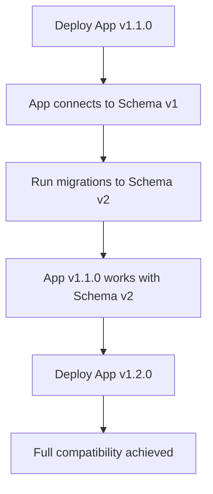
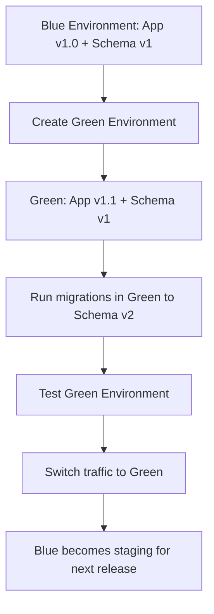
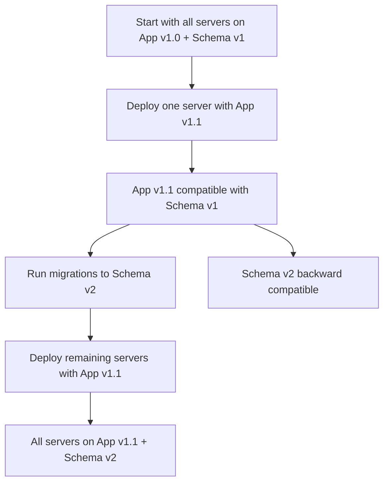

# WabbitBot Database Migration Strategy & Risk Profiles

## Executive Summary

This document outlines the comprehensive strategy for handling database schema migrations when deploying entity definition changes to production. Since WabbitBot currently has no production data, this strategy focuses on future deployment scenarios while providing immediate guidance for development.

## Current Development State (Zero Production Risk)

### Development Workflow
```bash
# Free restructuring (no production data concerns)
dotnet ef migrations add InitialCreate
dotnet ef database update

# Easy rollbacks during development
dotnet ef database update 0

# Rapid iteration on entity designs
dotnet ef migrations add AddNewFeature
dotnet ef database update
```

**Advantages:**
- ✅ **Zero Risk**: No data migration concerns
- ✅ **Easy Rollbacks**: Can reset database anytime
- ✅ **Rapid Iteration**: Test different entity designs freely

### ListWrapper Classes Elimination & Migration Impact

#### 🎯 **Zero Migration Impact - Complete Elimination**
ListWrapper classes are being **completely eliminated** from the architecture, so they have **zero impact** on database migrations:

**❌ Old Architecture (Being Removed):**
```csharp
public class PlayerListWrapper : Entity  // ❌ Being eliminated entirely
{
    public List<Player> Players { get; set; } = new();
    public DateTime LastUpdated { get; set; }
}
```

**✅ New Architecture:**
```csharp
public partial class CoreService  // ✅ All logic moves here
{
    // Business logic that was in ListWrapper classes
    public async Task<IEnumerable<Player>> GetActivePlayersAsync() =>
        await _dbContext.Players.Where(p => !p.IsArchived).ToListAsync();
}
```

#### Migration Impact Assessment:
- **Database Schema**: **UNCHANGED** - No impact whatsoever
- **Migration Scripts**: **NOT NEEDED** - Complete elimination, no migrations
- **Data Migration**: **NOT APPLICABLE** - No persistent data affected
- **Rollback Strategy**: **NOT NEEDED** - No database changes to rollback

#### Why This Matters:
1. **Architecture Simplification**: Removing unnecessary abstraction layer
2. **Performance Optimization**: Leverage PostgreSQL/EF Core capabilities directly
3. **Maintenance Reduction**: One less layer to maintain and test
4. **Deployment Simplification**: No database considerations for these classes

**Migration Workflow for ListWrapper Elimination:**
```bash
# 1. Move business logic to CoreService
# Identify valuable logic in ListWrapper classes
# Move to appropriate CoreService partial classes

# 2. Delete ListWrapper classes and interfaces
# Remove all ListWrapper-related files
# Update any references to use CoreService methods instead

# 3. No database migrations needed
# dotnet ef migrations add EliminateListWrappers  # ❌ NOT NEEDED

# 4. Deploy application changes only
# Pure code refactoring with no database impact
```

**Result**: **Clean elimination with zero database migration impact** - ListWrapper classes were never meant to be database entities, so removing them entirely has no migration consequences.

## Future Production Deployment Strategy

### Entity Change Categories & Risk Levels

#### 🟢 **Low Risk - Automatic Migration**
Safe changes that EF Core handles automatically with minimal planning.

**Examples:**
```csharp
// ✅ SAFE: Adding new properties with defaults
public class Player : Entity
{
    public string Name { get; set; }
    public string Email { get; set; } = ""; // ← New property with default
}

// ✅ SAFE: Adding new entities
public class Achievement : Entity
{
    public string PlayerId { get; set; }
    public string Type { get; set; }
    public DateTime EarnedAt { get; set; }
}

// ✅ SAFE: Renaming with column mapping
public class Player : Entity
{
    [Column("player_name")]  // ← Preserves old column
    public string Name { get; set; } // ← New property name
}
```

**Migration Process:**
```bash
dotnet ef migrations add AddPlayerEmail
dotnet ef database update  # Automatic handling
```

#### 🟡 **Medium Risk - Manual Planning Required**
Changes requiring custom migration scripts and thorough testing.

**Examples:**
```csharp
// 🟡 MEDIUM: Property removal with data preservation
// BEFORE
public class Player : Entity
{
    public string OldProperty { get; set; } // ← To be removed
}

// AFTER - Property removed, data archived
public class Player : Entity
{
    // OldProperty removed
}
```

**Migration Strategy:**
```csharp
protected override void Up(MigrationBuilder migrationBuilder)
{
    // Archive data before dropping
    migrationBuilder.Sql(@"
        CREATE TABLE player_archive_old_property AS
        SELECT id, old_property, created_at
        FROM players
        WHERE old_property IS NOT NULL;
    ");

    // Or migrate to JSON field for preservation
    migrationBuilder.Sql(@"
        UPDATE players
        SET metadata = jsonb_set(
            COALESCE(metadata, '{}'),
            '{archived_properties}',
            jsonb_build_object('old_property', old_property, 'archived_at', NOW())
        )
        WHERE old_property IS NOT NULL;
    ");

    // Drop the column
    migrationBuilder.DropColumn(name: "old_property", table: "players");
}
```

#### 🔴 **High Risk - Extensive Planning Required**
Complex changes requiring detailed migration strategies and extensive testing.

**Examples:**
```csharp
// 🔴 HIGH RISK: Entity splitting
// BEFORE: Single table
public class PlayerStats : Entity
{
    public string PlayerId { get; set; }
    public int Wins { get; set; }
    public int Losses { get; set; }
    public decimal Rating { get; set; }
}

// AFTER: Separate entities
public class Player : Entity
{
    public string Name { get; set; }
}

public class PlayerStats : Entity
{
    public string PlayerId { get; set; }
    public int Wins { get; set; }
    public int Losses { get; set; }
    public decimal Rating { get; set; }
}
```

**Migration Strategy:**
```csharp
protected override void Up(MigrationBuilder migrationBuilder)
{
    // Create new table
    migrationBuilder.CreateTable(name: "player_stats", /* ... */);

    // Migrate existing data
    migrationBuilder.Sql(@"
        INSERT INTO player_stats (id, player_id, wins, losses, rating, created_at, updated_at)
        SELECT gen_random_uuid(), id, wins, losses, rating, created_at, updated_at
        FROM players WHERE wins > 0 OR losses > 0;
    ");

    // Remove old columns
    migrationBuilder.DropColumn(name: "wins", table: "players");
    migrationBuilder.DropColumn(name: "losses", table: "players");
    migrationBuilder.DropColumn(name: "rating", table: "players");
}
```

## Production Deployment Workflow

### Phase 1: Development & Testing
```bash
# 1. Make entity changes in development
# 2. Create migration
dotnet ef migrations add UpdatePlayerStructure

# 3. Test migration on development database
dotnet ef database update

# 4. Test application functionality
# 5. Run unit and integration tests
dotnet test --filter MigrationTests

# 6. Test rollback procedures
dotnet ef database update PreviousMigration
dotnet ef database update
```

### Phase 2: Staging Environment Testing
```bash
# 1. Deploy to staging environment
# 2. Restore production-like data to staging
# 3. Run migration on staging
# 4. Test full application functionality
# 5. Load test with realistic data volumes
# 6. Verify data integrity and performance
```

### Phase 3: Production Deployment
```bash
# 1. Create comprehensive database backup
pg_dump wabbitbot > backup_$(date +%Y%m%d_%H%M%S).sql

# 2. Deploy application (migrations apply automatically)
# 3. Monitor migration progress and health checks
# 4. Verify application functionality
# 5. Monitor performance metrics
# 6. Validate key business metrics
```

## Application Startup Migration Strategy

### WabbitBot startup policy (no runtime DI)
- Development: apply migrations on startup when `Bot:Database:RunMigrationsOnStartup=true`.
- Production: disabled by default; migrate via deployment step or one-time flag.

```csharp
// Pseudocode matching WabbitBot.Host
var useEnsureCreated = config["Bot:Database:UseEnsureCreated"] == "true";
var runMigrations = config["Bot:Database:RunMigrationsOnStartup"] == "true";

await using var db = WabbitBotDbContextProvider.CreateDbContext();
if (runMigrations)
{
    await db.Database.MigrateAsync();
}
else if (useEnsureCreated)
{
    await db.Database.EnsureCreatedAsync();
}

var tracker = new SchemaVersionTracker(db);
await tracker.ValidateCompatibilityAsync();
```

### Health Check Integration
```csharp
public class DatabaseHealthCheck : IHealthCheck
{
    private readonly WabbitBotDbContext _dbContext;

    public DatabaseHealthCheck(WabbitBotDbContext dbContext)
    {
        _dbContext = dbContext;
    }

    public async Task<HealthCheckResult> CheckHealthAsync(
        HealthCheckContext context,
        CancellationToken cancellationToken = default)
    {
        try
        {
            // Check for pending migrations
            var pendingMigrations = await _dbContext.Database.GetPendingMigrationsAsync();

            if (pendingMigrations.Any())
            {
                return HealthCheckResult.Unhealthy(
                    $"Pending migrations: {string.Join(", ", pendingMigrations)}");
            }

            // Test database connectivity
            await _dbContext.Database.ExecuteSqlRawAsync("SELECT 1");

            return HealthCheckResult.Healthy("Database is healthy");
        }
        catch (Exception ex)
        {
            return HealthCheckResult.Unhealthy("Database health check failed", ex);
        }
    }
}
```

## Migration Testing Strategy

### Unit Tests for Migrations
```csharp
[TestFixture]
public class MigrationTests
{
    [Test]
    public async Task Migration_AddPlayerEmailColumn_ShouldPreserveExistingData()
    {
        // Arrange
        var options = new DbContextOptionsBuilder<WabbitBotDbContext>()
            .UseInMemoryDatabase("TestDb")
            .Options;

        using var context = new WabbitBotDbContext(options);

        // Create existing data
        var player = new Player { Name = "TestPlayer" };
        context.Players.Add(player);
        await context.SaveChangesAsync();

        // Act: Apply migration
        await context.Database.MigrateAsync();

        // Assert: Data preserved
        var migratedPlayer = await context.Players.FindAsync(player.Id);
        Assert.That(migratedPlayer.Name, Is.EqualTo("TestPlayer"));
        Assert.That(migratedPlayer.Email, Is.EqualTo("")); // Default value
    }
}
```

### Integration Tests with Realistic Data
```csharp
[TestFixture]
public class DataMigrationIntegrationTests
{
    [Test]
    public async Task ComplexEntitySplit_ShouldMaintainDataIntegrity()
    {
        // Test with production-like data volumes
        // Verify all constraints and relationships
        // Test query performance after migration
        // Validate business logic integrity
    }
}
```

## Rollback Strategy

### Automatic Rollback on Migration Failure
```csharp
public class MigrationService
{
    private readonly WabbitBotDbContext _context;
    private readonly ILogger<MigrationService> _logger;

    public async Task ApplyMigrationWithRollbackAsync(string migrationName)
    {
        using var transaction = await _context.Database.BeginTransactionAsync();

        try
        {
            // Apply migration
            await _context.Database.MigrateAsync();

            // Run post-migration validation
            await ValidateMigrationAsync();

            await transaction.CommitAsync();
            _logger.LogInformation($"Migration {migrationName} applied successfully");
        }
        catch (Exception ex)
        {
            // Automatic rollback on failure
            await transaction.RollbackAsync();
            _logger.LogError(ex, $"Migration {migrationName} failed, rolled back");
            throw;
        }
    }

    private async Task ValidateMigrationAsync()
    {
        // Validate data integrity
        await _context.Database.ExecuteSqlRawAsync("SELECT COUNT(*) FROM players");
        await _context.Database.ExecuteSqlRawAsync("SELECT COUNT(*) FROM seasons");

        // Additional validation queries as needed
    }
}
```

### Manual Rollback Procedures
```bash
# Emergency rollback to previous migration
dotnet ef database update PreviousMigrationName

# Rollback to specific point
dotnet ef database update 20240101000000_InitialCreate

# Restore from backup if needed
psql -d wabbitbot < backup_20240101.sql
```

## Migration Documentation Standards

### Migration Log Template
```markdown
# Migration: AddPlayerEmailColumn

## Date: 2024-01-15
## Migration Hash: abc123def456
## Applied By: deployment-pipeline
## Risk Level: 🟢 Low

## Changes
- Added `email` column to `players` table
- Type: VARCHAR(255)
- Default: empty string
- Nullable: false

## Data Impact
- No existing data affected
- New records get empty email by default
- Existing records get default empty string

## Rollback Plan
- Remove `email` column from `players` table
- Expected data loss: none

## Testing Results
- ✅ Unit tests: PASSED
- ✅ Integration tests: PASSED
- ✅ Staging deployment: SUCCESSFUL
- ✅ Performance tests: PASSED
- ✅ Data integrity validation: PASSED
```

## Best Practices Summary

### For Safe Deployments (Low Risk)
1. **Always create backups** before any migration
2. **Test migrations on staging** with production-like data
3. **Have rollback plans ready** for any scenario
4. **Monitor application health** during deployment
5. **Validate data integrity** post-migration

### For Complex Changes (Medium/High Risk)
1. **Plan data migration strategy** upfront with detailed scripts
2. **Consider feature flags** for gradual rollout if appropriate
3. **Test with realistic data volumes** and query patterns
4. **Have multiple rollback options** (migration rollback + backup restore)
5. **Document every step** of the migration process
6. **Schedule deployments** during low-traffic periods

### Monitoring & Alerting
1. **Set up alerts** for migration failures and performance degradation
2. **Monitor key metrics** during and after deployment
3. **Have on-call team ready** during deployment windows
4. **Track migration duration** and success rates
5. **Monitor database performance** post-migration

## Risk Assessment Framework

### Risk Scoring Criteria
- **Data Volume Impact**: How much data is affected
- **Schema Complexity**: How complex is the schema change
- **Downtime Tolerance**: How much downtime is acceptable
- **Rollback Complexity**: How difficult is it to rollback
- **Testing Requirements**: How much testing is needed

### Risk Mitigation Strategies
- **Low Risk**: Automated testing, standard deployment process
- **Medium Risk**: Additional integration testing, extended staging period
- **High Risk**: Manual review, phased rollout, extended monitoring period

## EF Core Migration Benefits

### Version Control Integration
- **Git-tracked migrations**: Schema changes are version controlled
- **Automatic rollback**: `dotnet ef database update 0` resets to clean state
- **Environment consistency**: Same schema across dev/staging/production
- **Type safety**: Schema changes validated against entity definitions

### Automated SQL Generation
- **No manual SQL**: EF Core generates optimized migration SQL
- **Database agnostic**: Works across different database providers
- **Performance optimized**: EF Core creates efficient migration scripts
- **Dependency aware**: Handles foreign key constraints automatically

### Development Workflow
- **Rapid iteration**: Easy to test schema changes during development
- **Safe experimentation**: Easy rollback when design changes don't work
- **Team collaboration**: Migrations can be shared and reviewed via Git
- **CI/CD integration**: Automated migration application in deployment pipelines

## PostgreSQL-Specific Considerations

### JSONB Migration Advantages
```csharp
// Adding JSON properties - ZERO RISK
public class Player : Entity
{
    public Dictionary<string, object> Metadata { get; set; } = new();
    // Adding new keys to Metadata requires NO migration
}
```

### Index Management
```csharp
// JSONB indexes for performance
protected override void Up(MigrationBuilder migrationBuilder)
{
    // GIN indexes for JSONB performance
    migrationBuilder.CreateIndex(
        name: "idx_players_metadata",
        table: "players",
        column: "metadata")
        .Annotation("Npgsql:IndexMethod", "GIN");

    // Partial indexes for specific JSON paths
    migrationBuilder.CreateIndex(
        name: "idx_players_active",
        table: "players",
        columns: new[] { "metadata" },
        filter: "metadata->>'isActive' = 'true'")
        .Annotation("Npgsql:IndexMethod", "GIN");
}
```

This comprehensive strategy ensures that when WabbitBot has production data, we can safely evolve entity definitions while maintaining data integrity, performance, and system availability.

## 📋 Related Documentation

- **[Main Refactor Plan](./refactor.md)** - Overall architecture refactoring steps
- **[Refactor Steps](./refactor-steps.md)** - Detailed implementation checklist
- **[Application & Database Versioning](./refactor.md#application--database-versioning-strategy)** - Loose coupling versioning strategy implementation

## 🎯 Quick Reference

### Current Status (Development Phase)
✅ **Zero Risk**: No production data concerns during development
✅ **Easy Rollbacks**: Can reset database anytime with `dotnet ef database update 0`
✅ **Rapid Iteration**: Test different entity designs freely

### Production Readiness Checklist
- [ ] Implement ApplicationInfo class for version tracking
- [ ] Create SchemaVersionTracker for database version detection
- [ ] Add version compatibility checking on startup
- [ ] Implement FeatureManager for gradual rollouts
- [ ] Create schema_metadata table for audit trail
- [ ] Set up VersionMonitor for drift detection
- [ ] Build comprehensive compatibility test suite
- [ ] Document version compatibility ranges

## Application & Database Versioning Strategy

### Modern Versioning Philosophy: **Loose Coupling**

**❌ OLD WAY**: Rigid version mapping
```
App v1.0.0 → Database Schema v1
App v1.1.0 → Database Schema v1 (no changes)
App v1.2.0 → Database Schema v2
App v2.0.0 → Database Schema v3
```

**✅ NEW WAY**: Independent evolution with compatibility ranges
```
App v1.0.0 to v1.5.0 → Compatible with Schema v1-v2
App v1.6.0 to v2.0.0 → Compatible with Schema v2-v3
App v2.1.0+ → Compatible with Schema v3+
```

### Key Principles

#### 1. **Semantic Versioning for Both**
```bash
# Application versioning
MAJOR.MINOR.PATCH
1.0.0 → Breaking changes
1.1.0 → New features (backward compatible)
1.1.1 → Bug fixes

# Database schema versioning
SCHEMA-MAJOR.MINOR
001-1.0 → Initial schema
001-1.1 → Additive changes (backward compatible)
002-1.0 → Breaking schema changes
```

#### 2. **Zero-Downtime Deployment Strategy**


#### 3. **Compatibility Matrix (Not Rigid Mapping)**
```markdown
# Compatibility Matrix
| App Version | Min Schema | Max Schema | Notes |
|-------------|------------|------------|-------|
| 1.0.x      | 001-1.0    | 001-1.1    | Legacy support |
| 1.1.x      | 001-1.0    | 002-1.0    | Extended compatibility |
| 1.2.x+     | 002-1.0    | current    | Modern features |
```

### Implementation Patterns

#### 1. **Migration-Aware Application Startup**
```csharp
public class ApplicationVersionChecker
{
    public async Task ValidateCompatibilityAsync()
    {
        var appVersion = GetCurrentAppVersion();
        var schemaVersion = await GetCurrentSchemaVersionAsync();

        if (!IsCompatible(appVersion, schemaVersion))
        {
            throw new IncompatibleVersionException(
                $"App {appVersion} incompatible with Schema {schemaVersion}");
        }
    }

    private bool IsCompatible(string appVersion, string schemaVersion)
    {
        // Define compatibility ranges
        var ranges = new Dictionary<string, (string min, string max)>
        {
            ["1.0.x"] = ("001-1.0", "001-1.1"),
            ["1.1.x"] = ("001-1.0", "002-1.0"),
            ["1.2.x"] = ("002-1.0", "999-9.9")
        };

        foreach (var range in ranges)
        {
            if (VersionMatches(appVersion, range.Key))
            {
                return VersionInRange(schemaVersion, range.Value.min, range.Value.max);
            }
        }

        return false;
    }
}
```

#### 2. **Feature Flags for Gradual Rollouts**
```csharp
public class FeatureManager
{
    public bool IsNewLeaderboardEnabled =>
        AppVersion >= new Version("1.2.0") &&
        SchemaVersion >= "002-1.0";

    public bool UseLegacyStatsFormat =>
        SchemaVersion < "002-1.0";
}
```

#### 3. **Database Migration Pipeline**
```yaml
# deployment-pipeline.yml
stages:
  - test:
      - run_migrations_on_test_db
      - deploy_app_to_test
      - validate_compatibility

  - staging:
      - backup_staging_db
      - run_migrations_staging
      - deploy_app_rolling_update
      - monitor_health_checks

  - production:
      - backup_production_db
      - run_migrations_production
      - deploy_app_blue_green
      - validate_business_metrics
```

### Deployment Strategies

#### **Strategy 1: Blue-Green Deployment**


#### **Strategy 2: Rolling Deployment with Compatibility**


### Version Tracking Implementation

#### 1. **Application Version Tracking**
```csharp
public static class ApplicationInfo
{
    public static Version CurrentVersion => new Version(
        FileVersionInfo.GetVersionInfo(Assembly.GetExecutingAssembly().Location).FileVersion);

    public static string VersionString => CurrentVersion.ToString(3);
}
```

#### 2. **Database Schema Version Tracking**
```csharp
public class SchemaVersionTracker
{
    private readonly WabbitBotDbContext _context;

    public async Task<string> GetCurrentSchemaVersionAsync()
    {
        // Get latest migration applied
        var migrations = await _context.Database.GetAppliedMigrationsAsync();
        var latestMigration = migrations.OrderByDescending(m => m).FirstOrDefault();

        // Extract version from migration name
        // e.g., "20240101120000_AddPlayerStats" → "001-1.2"
        return ParseMigrationToSchemaVersion(latestMigration);
    }
}
```

#### 3. **Version Metadata Table**
```sql
CREATE TABLE schema_metadata (
    id UUID PRIMARY KEY DEFAULT gen_random_uuid(),
    schema_version VARCHAR(20) NOT NULL,
    applied_at TIMESTAMP NOT NULL DEFAULT NOW(),
    applied_by VARCHAR(255),
    description TEXT,
    is_breaking_change BOOLEAN NOT NULL DEFAULT FALSE
);

-- Track schema versions in migrations
INSERT INTO schema_metadata (schema_version, description, is_breaking_change)
VALUES ('002-1.0', 'Add player statistics tracking', false);
```

### Best Practices Summary

#### **1. Design for Compatibility Ranges**
- Apps should work with multiple schema versions
- Design APIs to be tolerant of missing/ extra fields
- Use feature flags for new functionality

#### **2. Independent Release Cycles**
- Database migrations can be released independently of app deployments
- App versions don't need to map 1:1 with schema versions
- Allows for faster iteration on either side

#### **3. Comprehensive Testing**
```csharp
[TestFixture]
public class VersionCompatibilityTests
{
    [TestCase("1.0.0", "001-1.0", ExpectedResult = true)]
    [TestCase("1.0.0", "001-1.2", ExpectedResult = false)] // Incompatible
    [TestCase("1.1.0", "001-1.0", ExpectedResult = true)]  // Backward compatible
    [TestCase("1.1.0", "002-1.0", ExpectedResult = true)]  // Forward compatible
    public bool VersionCompatibility_Works(string appVersion, string schemaVersion)
    {
        return VersionChecker.IsCompatible(appVersion, schemaVersion);
    }
}
```

#### **4. Monitoring & Alerting**
```csharp
public class VersionMonitor
{
    public void CheckVersionDrift()
    {
        var appVersion = ApplicationInfo.VersionString;
        var schemaVersion = GetCurrentSchemaVersion();

        if (!IsCompatible(appVersion, schemaVersion))
        {
            _alertService.SendAlert(
                $"Version mismatch: App {appVersion} vs Schema {schemaVersion}");
        }
    }
}
```

#### **5. Documentation**
```markdown
# Version Compatibility Guide

## Current Support Matrix
- **App v1.0.x**: Schema 001-1.0 to 001-1.1
- **App v1.1.x**: Schema 001-1.0 to 002-1.0
- **App v1.2.x+**: Schema 002-1.0+

## Migration Windows
- **Zero-downtime**: 1.1.x apps work during 001→002 migration
- **Grace period**: 30 days for version upgrades
- **Legacy support**: 6 months for major version transitions
```

### Key Takeaway

**Modern applications should NOT have rigid version mappings.** Instead:

1. **Define compatibility ranges** where apps work with multiple schema versions
2. **Use semantic versioning** for both applications and schemas
3. **Design for rolling deployments** with backward/forward compatibility
4. **Implement feature flags** for gradual feature rollouts
5. **Monitor version compatibility** in production
6. **Test extensively** across version combinations

This approach gives you maximum flexibility for independent evolution of application and database schemas while maintaining system stability and enabling zero-downtime deployments. The risk-based approach ensures appropriate testing and planning for each type of change.
